# PP5 Football Crazy

## Developer: Róisín O'Connell 

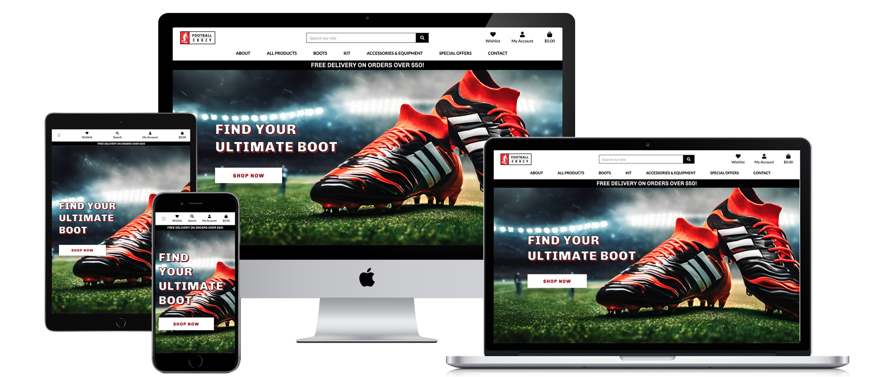

[View the live project here](https://football-crazy-pp5-5b2eb292c933.herokuapp.com/)

[View GitHub repository](https://github.com/roc-11/football-crazy-pp5)

[](https://github.com/roc-11/football-crazy-pp5/commits/main)
[](https://github.com/roc-11/football-crazy-pp5/commits/main)
[](https://github.com/roc-11/football-crazy-pp5)

## Introduction

The goal of Football Crazy is to be a comprehensive e-commerce store where users can purchase football boots, training kits, coaching equipment, accessories, and other football-related products. This site provides a seamless shopping experience with several user-friendly features:

- **User Accounts**: Users can create accounts, sign in, and log out. Authenticated users have personalized profile pages showing order history, wishlisted products, and the option to add default delivery information.
- **Administrator Features**: Site administrators have access to a newsletter feature from their user profile. They can create, edit, and delete products, send newsletters, and view contact form submissions. Administrators must also approve product reviews before they appear on the product detail page. 
- **Product Interaction**: Users can add or remove items from their personal wishlist and leave reviews on products they have purchased.
- **Product Display**: The home page showcases the latest arrivals, deals, clearance items, and special offers. Users can sign up for the Football Crazy newsletter to stay updated.
- **Product Browsing**: The products page allows users to view all items in the store or shop by category. It features instant sorting by price, name, or rating.
- **Shopping Bag**: Users can add, edit quantities, or remove products from their shopping bag, and securely check out using the Stripe payment network. Upon successful order completion, users receive an email confirmation.
- **Admin Control**: Admins have full control over product management and can monitor customer interactions through newsletters and contact form submissions.

This site was created for the Code Institute's PP5 project to demonstrate an agile approach to developing a fully functional e-commerce website.

## UX

### Planning Stage

#### Aim

The aim of Football Crazy is to provide an online e-commerce platform to allow site users/shoppers/footballers to purchase the latest elite boots and football products. The store should be intuitive and easy to use, allowing both registered users and guest users to make purchases. Frequest users can make an account, allowing them to checkout quicker by saving their delivery details, and also allowing them to keep track of their past orders. To promote the business, social media pages such as Facebook will be used, as well as allowing users to subscribe to Football Crazy's newsletter. The site also aims to allow users to favourite, or add products to their wishlist, which they can purchase on a later date. 

The site aims to make adding, editing and deleting products from the store simple for the store owner. The owner (site admin) aims to easily do this from the front-end, by completing a form/clicking a button.

#### Application Goals

Goals for New Users
* As a new site user, I would like to view an intuitive website with straightforward navigation that is fully responsive, for an easy shopping experience.
* As a new site user, I would like to checkout as a guest without creating an account.
* As a new site user, I would like to create an account so that I can store my delivery details, save my order history and submit product reviews.
* As a new site user, I would like to add products to my wishlist so that I can return to them at a later date/time.
* As a new site user, I would like to easily edit and delete any reviews that I write.
* As a new site user, I would like to easily contact the website administrators with questions.
* As a new site user, I would like to easily understand the main purpose of the site/store.
* As a new user, I want attractive and relevant visuals and colour schemes that work with the content.

Goals for Returning Users
* As a returning site user, I would like to view an intuitive website with straightforward navigation that is fully responsive, for an easy shopping experience.
* As a returning site user, I would like to easily log into my account so that I can edit my delivery details, view my order history and submit product reviews.
* As a returning site user, I would like to checkout quickly using my stored/saved delivery information.
* As a new site user, I would like to add products to my wishlist so that I can return to them at a later date/time.
* As a new site user, I would like to easily edit and delete any reviews that I write.


Goals for Site Administrators
* As a site administrator, I would like to have a recognizable branded Django admininstator area to manage users, products, categories, contact requests, about page, reviews and the newsletter.
* As a site administrator, I would like to easily add a new product to the store from the front-end/website.
* As a site administrator, I would like to easily edit or delete a product from the store from the front-end/website.
* As a site administrator, I would like to easily send a newsletter email to all newsletter subscribers using a user-friendly UI.
* As a site administrator, I would like to easily edit the about text and profile picture using a user-friendly UI.
* As a site administrator, I would like to have control over approving site user reviews before they appear on the Football Crazy Store website.
* * As a site administrator, I would like to manage user contact requests and mark them as read.
As a site administrator, I would like to have a simple UI that will encourage users to return and engage with the store.

Goals for Shoppers
* As a shopper, I want to easily find the products and their details.
* As a shopper, I want to view products on a specific category.
* As a shopper, I want to be able to sort the products depending on their price, rating or category.
* As a shopper, I want to be able to search for products using specific keywords.
* As a shopper, I want to easily select the quantity of products to be purchased.
* As a shopper, I want to easily view the current purchase amount.
* As a shopper, I want to view all items currently in my shopping cart and be able to update them.
* As a shopper, I want to easily provide my shipping and payment information during the checkout.
* As a shopper, I want to feel my personal and payment data is being handled securely.
* As a shopper, I want to receive an order confirmation once I have finished my purchase.
* As a shopper, I want to receive an order confirmation email for my records.
* As a shopper, I want to be able to read product reviews left by other shoppers.

Goals for Frequent Shoppers/Registered Users
* As a frequent shopper, I want to be able to register an account using my email address to be able to keep my records and interact with the website.
* As a frequent shopper, I want to receive a confirmation once my account has been registered to make sure the information entered was correctly.
* As a registered shopper, I want to easily log in and log out from my account.
* As a registered shopper, I want to be able to recover access to my account in case I forget my password.
* As a registered shopper, I want to have a personalized profile page where I can keep my contact information updated and see my past orders.
* As a registered shopper, I want to be able to leave product reviews and rate the products.
* As a registered shopper, I want to be able to keep a list of my favorite products to purchase again in the future.
* As a registered shopper, I want to be able to easily add and remove products from my wishlist.

#### User Stories

All epics, user stories with their acceptance criteria and tasks can be viewed on the [Github Project Board](https://github.com/users/roc-11/projects/6).

- There were 18 Epics created from Project Concept to Project Submission.

- There were 52 User Stories Created including:
    1. USERSTORY # 1: Gather General Requirements & Visual Layout
        - As a Developer I can see how the site should be laid out and make a detailed plan so that the site functionality can be developed in an incremental manner.
    2. USERSTORY #2: Initial Django project setup
        - As a developer I can set up the initial project files in the developer environment and deploy to Heroku so that I have a base for my project and can resolve any deployment issues early on.
    3. USERSTORY # 3: Create Front-End Site, using Bootstrap Template
        - As a Developer I can design and deploy a basic website so that it meets the minimum viable requirements.
	4. USERSTORY #4: View a list of products.
        - As a Shopper I can view a list of products so that I can select something to purchase.
	5. USERSTORY #5: View individual product details.
        - As a shopper I can view individual product details so that I can identify the price, description, product rating, product image and available sizes.
	6. USERSTORY #6: Identify deals, clearance items and special offers.
        - As a shopper I can quickly identify deals, clearance items and special offers so that I can take advantage of special savings on products that I'd like to purchase.
	7. USERSTORY #7: View the total of my purchases. 
        - As a Shopper I can easily view the total of my purchases so that I can avoid spending too much.
	8. USERSTORY #8: Register for an account
        - As a Site User I can easily register for an account so that I can have a personal account and be able to view my profile.
	9. USERSTORY #9: Login or Logout
        - As a Site User I can easily login or logout so that I can access my personal account information.
	10. USERSTORY #10: Recover Password
        - As a Site User I can easily recover my password in case I forget it so that I can recover access to my account.
	11. USERSTORY #11: Email confirmation upon registration
        - As a Site User I can receive an email confirmation after registering so that I can verify my account registration was successful.
	12. USERSTORY #12: Create SuperUser Account
        - As a Site Admin I want to create a superuser account so that I can access the Django Admin area.
	13. USERSTORY #13: Sort list of available products
        - As a Shopper I can sort the list of available products so that I can easily identify the best rated, best priced and categorically sort the products.
	14. USERSTORY #14: Sort a specific category of product
        - As a Shopper I can sort a specific category of product so that I can find the best priced or best rated product in a specific category, or sort the products in that category by name.
	15. USERSTORY #15: Sort multiple categories simultaneously
        - As a Shopper I can sort multiple categories of products simultaneously so that I can find the best priced or best rated products across broad categories, such as "boots" or "accessories".
	16. USERSTORY #16: Search for a product
        - As a Shopper I can search for a product by name or description so that I can find a specific product I'd like to purchase.
	17. USERSTORY #17: Search Results
        - As a Shopper I can easily see what I have searched for and the number of results so that I can quickly decide whether the product I want is available.
	18. USERSTORY #18: View a specific category of products
        - As a Shopper I can view a specific category of products so that I can quickly find products I'm interested in without having to search through all products.
	19. USERSTORY #19: Select the size and quantity of a product when purchasing it
        - As a Shopper I can easily select the size and quantity of a product when purchasing it so that I ensure that I do not accidentally select the wrong product or quantity or size.
	20. USERSTORY #20: View items in my bag to be purchased
        - As a Shopper I can view items in my bag to be purchased so that I identify the total cost of my purchase and all items I will recieve.
	21. USERSTORY #21: Adjust the quantity of individual items in my bag
        - As a Shopper I can adjust the quantity of individual items in my bag so that I can easily make changes to my purchase before checkout.
	22. USERSTORY #22: Enter payment information
        - As a Shopper I can easily enter my payment information so that I can check out quickly and with no hassle.
	23. USERSTORY #23: Feel my personal and payment information is safe and secure
        - As a Shopper I can feel my personal and payment information is safe and secure so that I can confidently provide the needed information to make a purchase.
	24. USERSTORY #24: View an order confirmation after checkout
        - As a Shopper I can view an order confirmation after checkout so that I can verify that I haven't made any mistakes.
	25. USERSTORY #25: Receive an email confirmation after checking out
        - As a Shopper I can receive an email confirmation after checking out so that I can keep the confirmation of what I've purchased for my records.
	26. USERSTORY #26: Add a product
        - As a Store Owner I can add a product so that I can add new items to my store.
	27. USERSTORY #27: Edit/update a product
        - As a Store Owner I can edit/update a product so that I can change product prices, descriptions, images and other product criteria.
	28. USERSTORY #28: Delete a product
        - As a Store Owner I can delete a product so that I can remove items that are no longer for sale.
	29. USERSTORY #29: Personalise User Profile
        - As a Site User I can have a personalized user profile so that I can view my personal order history and order confirmations, and save my payment information.
	30. USERSTORY #30: Customise admin area branding
        - As a Site Admin I can recognise the admin area has the same look & feel as the front-end site so that website continuity is maintained.
	31. USERSTORY #31: Read about the site
        - As a Site User I can click on the About link so that I can read about the site.
	32. USERSTORY #32: Add and update about text
        - As a Site Admin I can create or update the about page content so that it is available on the site.
	33. USERSTORY #33: Request for contact page
        - As a Shopper I can fill in a contact form so that I can submit a request for contact.
	34. USERSTORY #34: Review contact requests
        - As a Site Admin I can store contact/collaboration requests in the database so that I can review them.
	35. USERSTORY #35: Manage Contact Requests
        - As a Site Admin I can mark contact/collaboration requests as "read" so that I can see how many I still need to process.
	36. USERSTORY #36: View reviews and submit a review/rating for a product
        - As a Shopper/Site User I want to view product reviews and ratings so that I can decide whether the product is worth purchasing and gain trust in the product/store.
	37. USERSTORY #37: Modify or delete a review
        - As a Shopper/Site User I want to add, modify or delete a product review so that I can review a product I purchased and help other shoppers to make a good choice/contribute to the site.
	38. USERSTORY #38: Approve reviews
        - As a Site Admin I can approve or disapprove reviews so that I can filter out objectionable/spam reviews.
	39. USERSTORY #39: Create templates to handle onscreen notifications (success, error, warning and info messages)
        - As a Shopper/Site User I want to get notifications when I perform an action, such as a success message so that I know whether my interaction/action was successful or not and that I receive feedback.
	40. USERSTORY #40: Create Post Model for Blog
        - As a site admin I can create, read, update and delete blog posts in the admin section so that I can manage my blog content. 
	41. USERSTORY #41: Display Post Detail
        - As a Site User I can click on a post so that I can read the full text.
	42. USERSTORY #42: Manual Testing of Project
        - Manual testing of website and functionality of store/profile/etc.
	43. USERSTORY #43: Code Validation
        - Code Validation process 
	44. USERSTORY #44: Write Project Documentation
        - As a Developer I want to document my Django project so that the whole process for the ecommerce store is documented.
	45. USERSTORY #45: Final Deployment
        - As a Developer I want to deploy my project/website so that it can be accessed publicly online.
	46. USERSTORY #46: Project Submission
        - Submit final project for grading
	47. USERSTORY #47: Wishlist
        - As a Shopper/site user I want to be able to add and view products to a wish list so that I can save products I would wish to purchase in the future.
	48. USERSTORY #48: Newsletter
        - As a site user I want to subscribe to the newsletter so that I keep up to date with the latest store news and deals.
	49. USERSTORY #49: Newsletter
		- As a Site Admin I can create Comments table/model so that I can manage comments.
	50. USERSTORY #50: Newsletter
		- As a Site User/Admin I can view comments on an individual post so that I can read the conversation.
	51. USERSTORY #51: Newsletter
		- As a Site User I can modify or delete my comment on a post so that I can be involved in the conversation.
	52. USERSTORY #52: Newsletter
		- As a Site Admin I can approve or disapprove comments so that I can filter out objectionable comments.

### Wireframes

The appearance of each page of the website was planned by making wireframes. It was essential to provide a positive user experience for the user. 

Initially, wireframes plans were hand-drawn on a notepad. More detailed wireframes were then created using a desktop version of [Balsamiq](https://balsamiq.com/ "Link to Balsamiq homepage").

They can be found below:

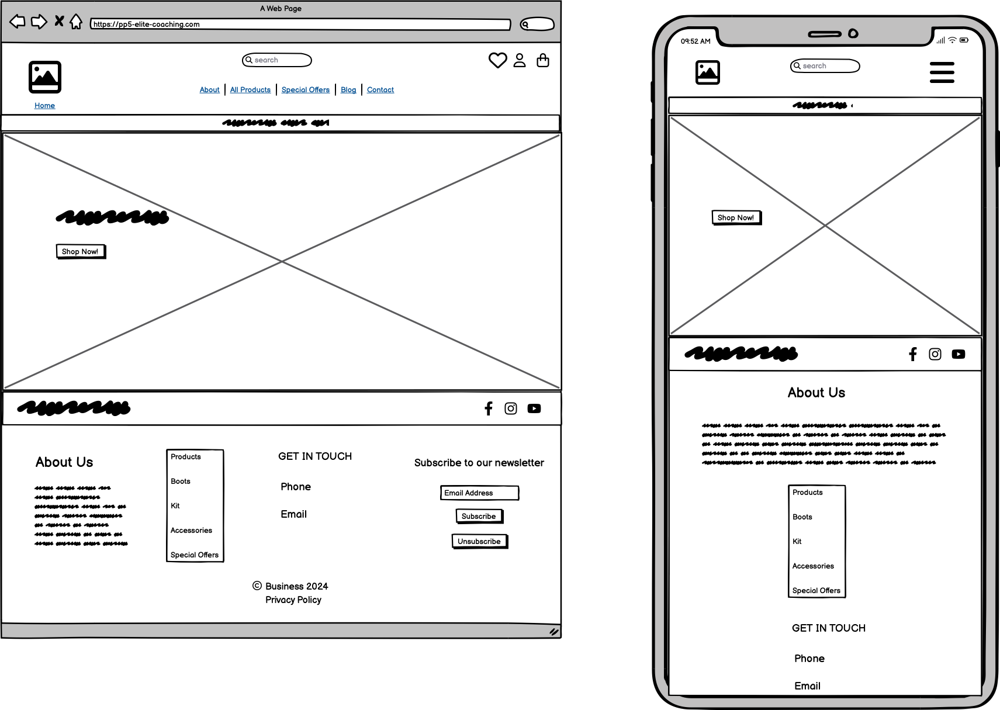

.png)

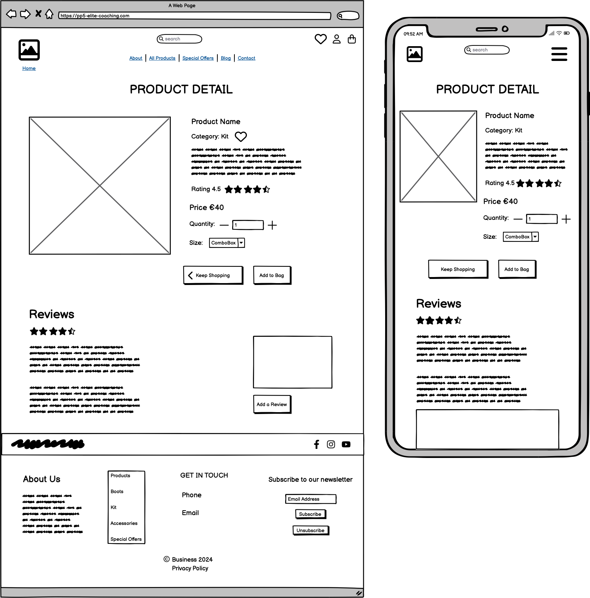

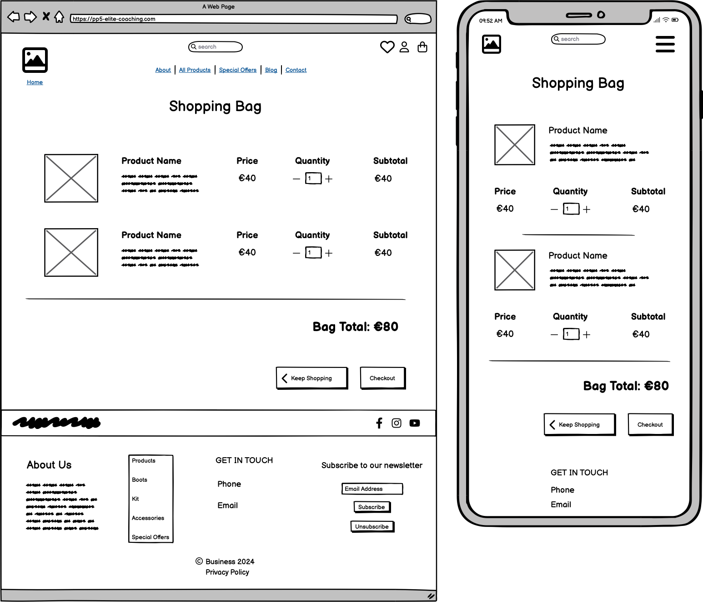

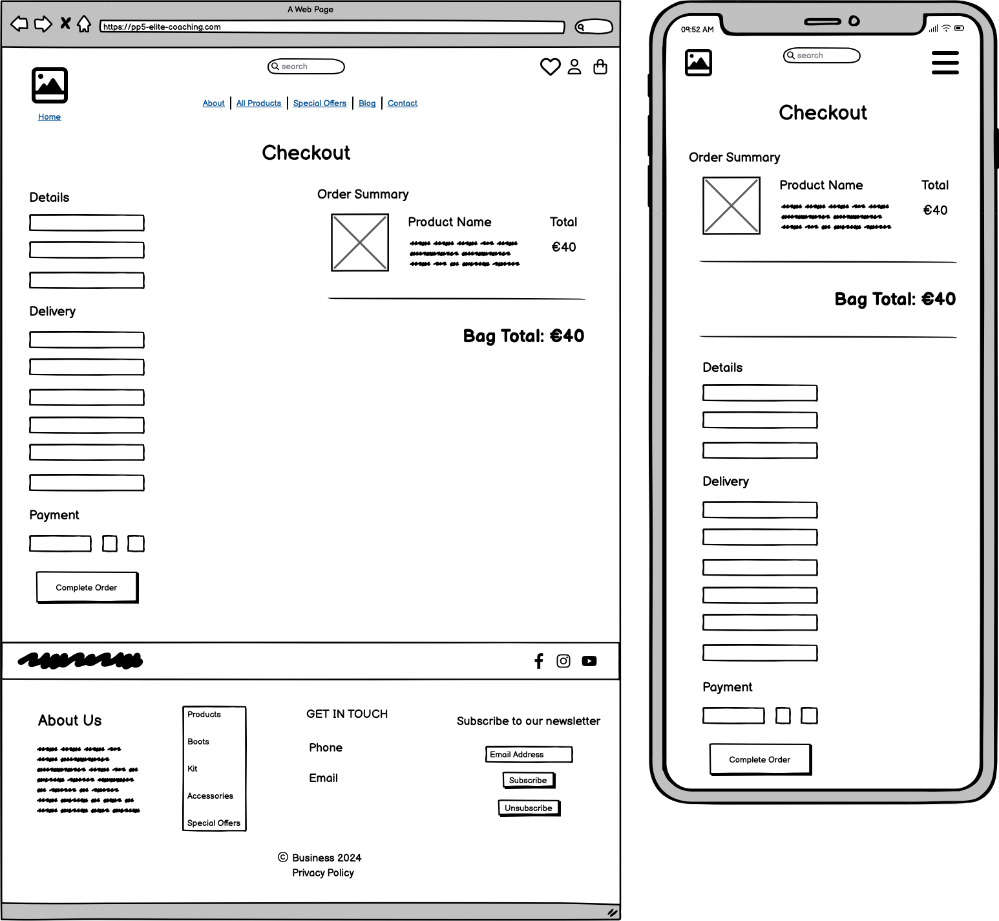

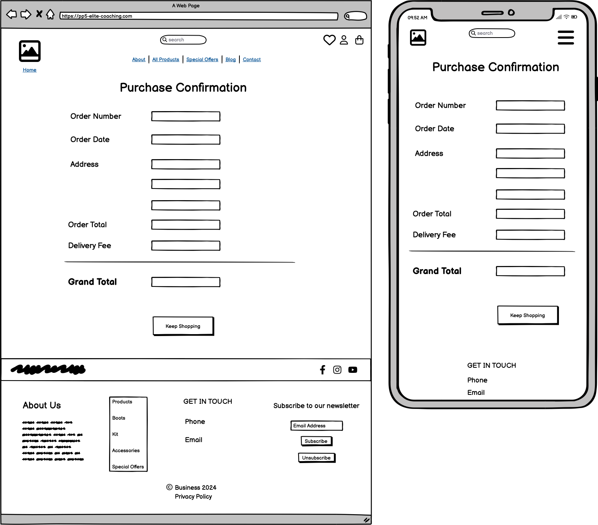

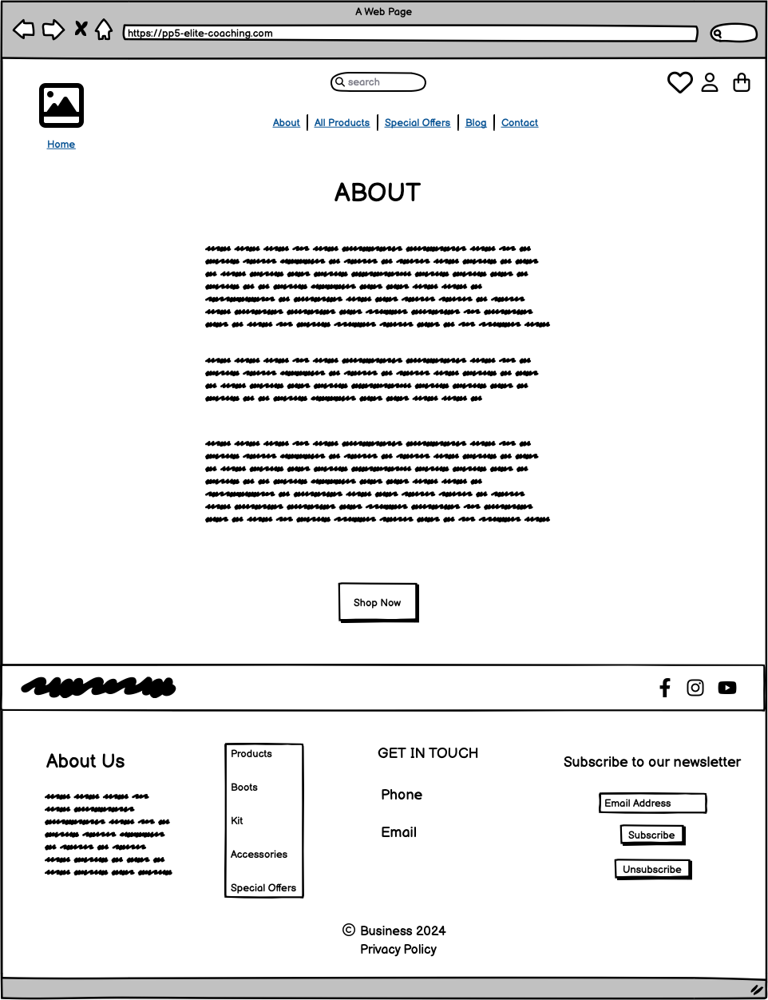

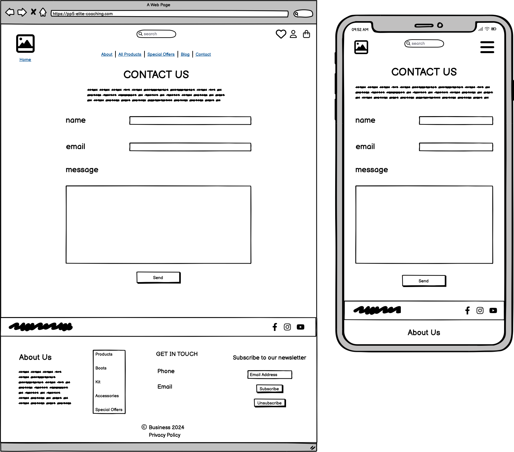

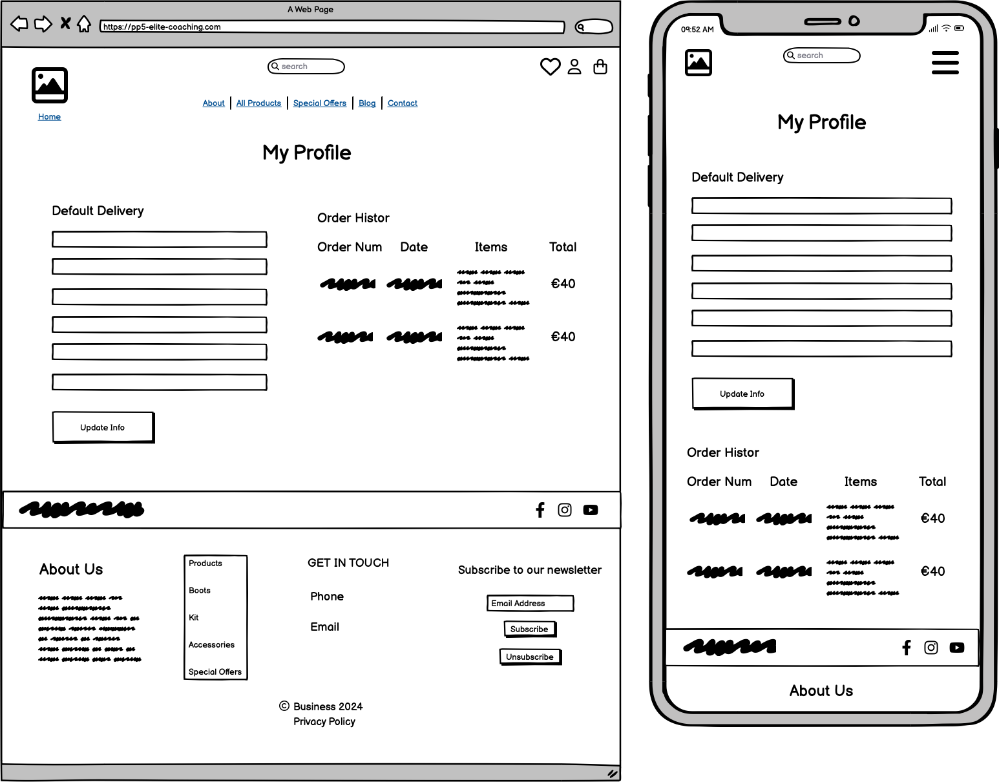

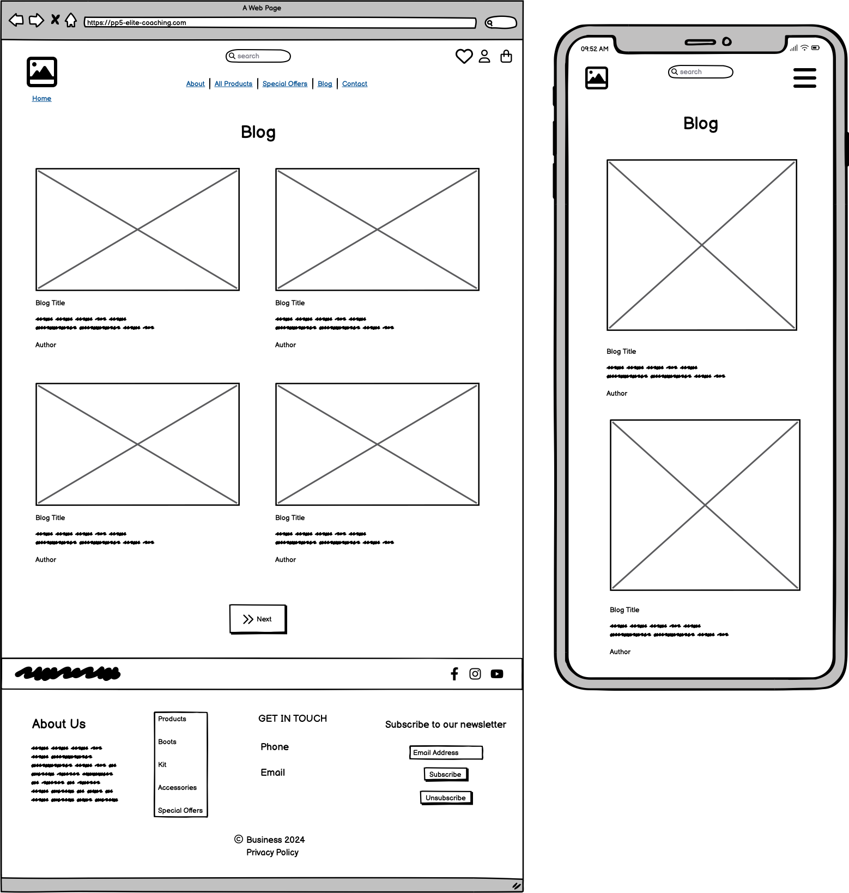

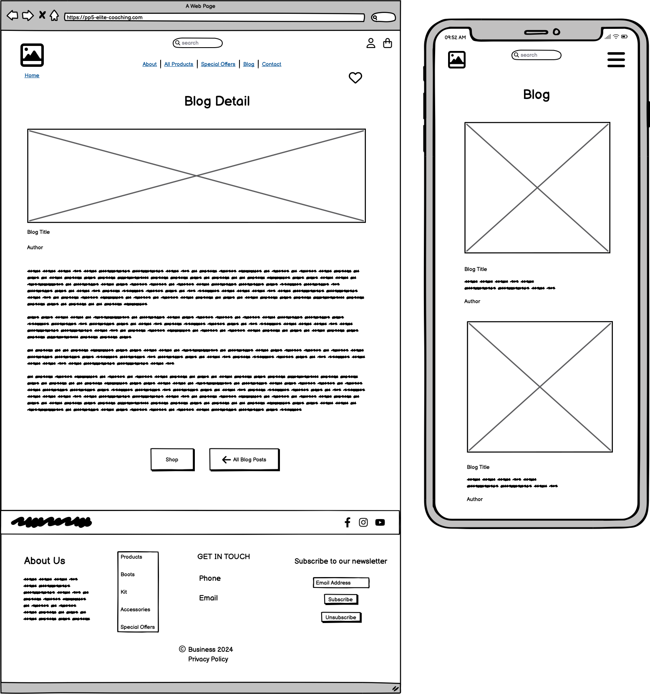

### Flow Chart

To follow best practice, a flowchart was created for the website's logic, and mapped out before coding began using a free version of [Lucidchart](https://www.lucidchart.com/pages/ER-diagram-symbols-and-meaning).

Below is the flowchart of the main process of this website:


### Colour Scheme

The colour scheme for Football Crazy is inspired by the ["Adidas Predator Elite" football boot](https://www.prodirectsport.com/soccer/p/adidas-predator-elite-laced-firm-ground-core-black-white-solar-red-adult-boots-1011326/). The main background of the site is a simple, clean white. This is start contrast with the black text, headings, buttons and links. The red shades add a pop of colour to certain elements of the site. The red is used for the FC site branding/logo, as well as for certain elements of the wishlist, etc. It constantly reminds the user of the adidas Predator Elite on the homepage, and is the classic boot colour. 

I chose a simple black and white color scheme for the Football Crazy e-commerce website to create a clean, modern, and professional look. The minimalist approach helps to highlight our high-quality football products, making it easier for customers to focus on the items rather than being distracted by a busy background. Additionally, black and white are classic colors that convey trust and reliability, aligning with our commitment to great customer service and dependable delivery. This color scheme ensures that our site is easy to navigate, providing a seamless shopping experience for our users.

Details of the full colour palette can be found below:


### Typography

The pairing chosen for the site are: 
* [Chivo](https://fonts.google.com/specimen/Chivo?preview.text=Max%20Rehab%20Physiotherapy&preview.text_type=custom)
* [Lato](https://fonts.google.com/specimen/Lato)
* A backup of 'Lato' and sans-serif are applied in case of failure.

Chivo is used for title headings, while Lato is used for almost all other text. Both were imported from[Google Fonts](https://fonts.google.com/).

## Features

The following features have been implemented:
1. Fully responsive website consisting of:
  - Home
  - About
  - Contact
  - Products - Categorised, Searchable and Sortable
  - Product Details
  - Product Reviews (with CRUD functionality for logged in users to write a review (reviews can be edited or deleted))
  - Shopping Bag
  - Checkout & Checkout Success
  - Login
  - Logout
  - Register
  - Forgot Password
  - Product Admin (with CRUD functionality for superusers to add, edit and delete products on the front-end)
  - Profile 
  - Wishlist
  - Newsletter
  - 404 Error

### Existing Features

### Navigation

* Featured at the top of the page, the navigation shows the Football Crazy logo in the left corner. This image is clickable and it links the user back to the homepage. On smaller devices the Home link is displayed in the burger menu, as text, in order to save screen space. 
* The other navigation links, which link to different pages of the site, are: 
	- Logo Image (link to homepage)
	- Search box ([see more here](#product-search))
	- About
	- All Products - Dropdown Menu (by Price, Rating, Category or All)
	- Boots - Dropdown Menu (Firm Ground, Sort Ground, Artificial Grass or All Boots)
	- Kit - Dropdown Menu (Jerseys, Shorts, Socks or All Kit)
	- Accessories & Equipment - Dropdown Menu (Footballs, Shinpads, Goalkeeper Gloves, Coaching or All Accessories & Equipment)
	- Special Offers - Dropdown Menu (New Arrivals, Deals, Clearance or All Specials)
	- Contact
	- Wishlist
	- My Account - Dropdown Menu (Login/Register/Logout/My Profile/Product Management)
	- Shopping Bag
* The navigation makes clear the name of the company and website.
* The navigation makes the different sections of information easy to find.
* On smaller devices the navigation converts to a burger menu.

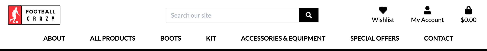

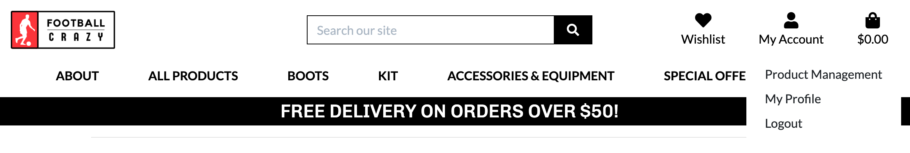

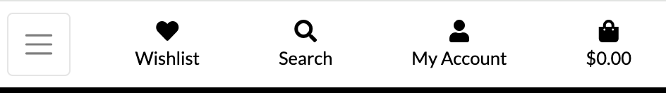

### Footer

* Featured at the bottom of the page, the footer consists of a red banner (in keeping with the Football Crazy branding) with links to the various social media pages, as per the business marketing strategy. 
* Below the banner are 4 columns: 
	1. About Us - with a short blurb about Football Crazy 
	2. Products - links to the main product sections for the store website. 
	3. Contact Us - with basic, at a glance contact information. This makes it easy for the customer to find contact info quickly. 
	4. Newsletter subscribe/unsubscribe buttons (explained in detail in the [Newsletter](#newsletter) section below.)
	5. Privacy Policy - link to the Football Crazy Privacy Policy, made with [www.privacypolicygenerator.info](https://www.privacypolicygenerator.info/).
* On smaller devices the coloumns are stacked for responsive display. 

Footer Desktop            |  Footer Mobile
:-------------------------:|:-------------------------:
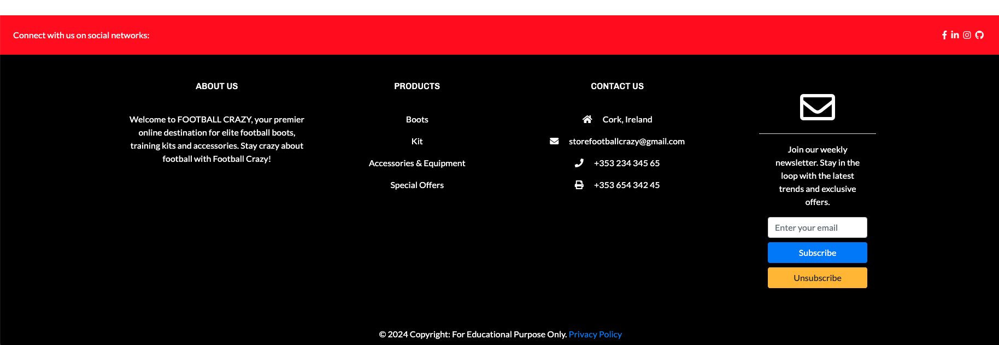  |  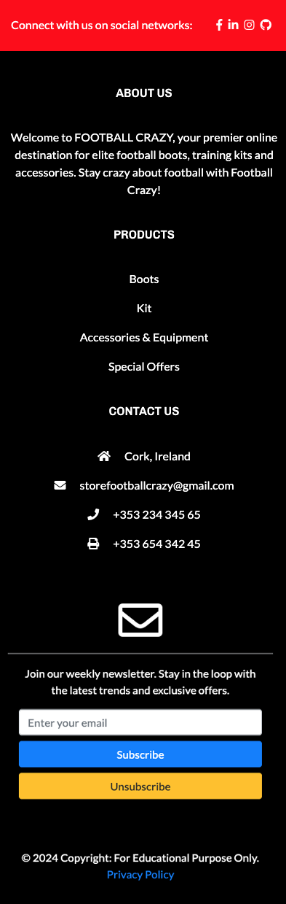

### Homepage

* The homepage consists of a large hero image. Here the user is welcomed with the tagline "Find your ultimate boot".
* The 'SHOP NOW' button takes the user to the 'All Products' page. There is a cool UI hover effect on this button, where a red border top and bottom appears when a user hovers over this button. 
* Above the hero image is a black banner with the free delivery offer/discount - "Free delivery on orders over $50. This encourages shoppers immediately to spend more than $50 in the store. 
* All of the elements on the page follow the company branding colours of white, black and red. There is a black border around the title tagline, and a red shadow to ensure the text is readable and stands out. 
* The hero image is a striking and eye-catching zoom in of the latest Adidas Predator boots, on the background of a stadium. This was generated using AI especially for the Football Crazy Store. 

Homepage Desktop            |  Homepage Mobile
:-------------------------:|:-------------------------:
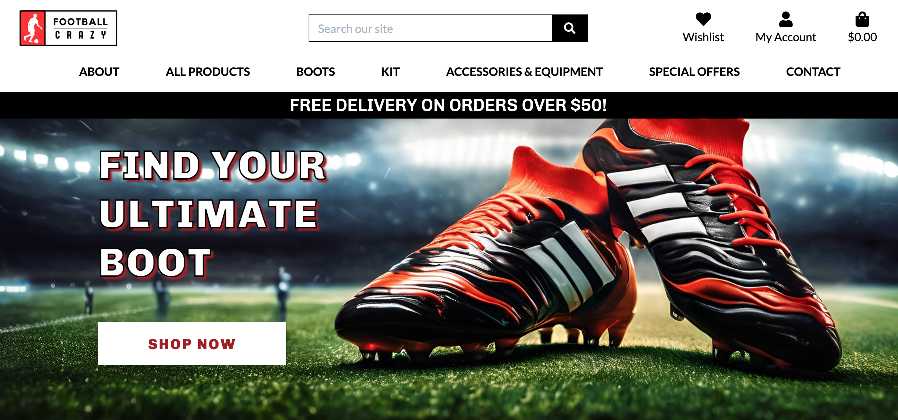  |  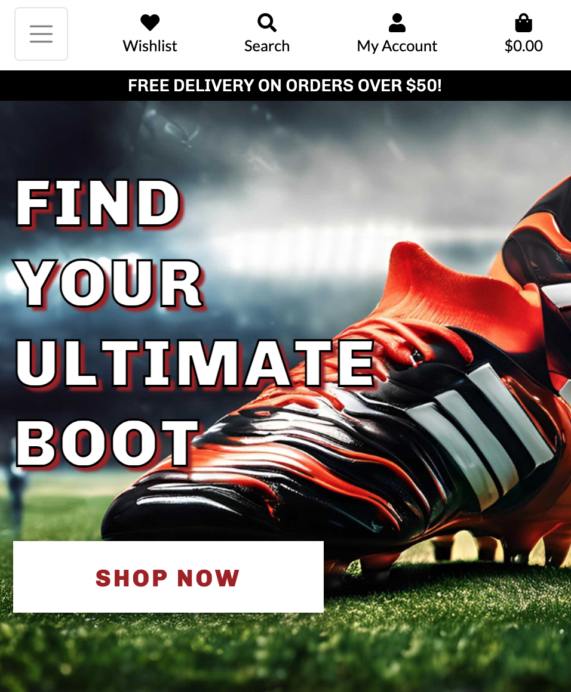

### Products Page

* The Products Page (All Products) displays all the products currently available, or filtered on a specific category.
* Each product from the Products table is rendered as a card. The card for each product contains: 
		- A Product Image (which is a link the the Product Details page for that specific product)
		- A Product Name (which is a link the the Product Details page for that specific product)
		- The price of the product
		- The category of the product (which is a link to that category page)
		- The product rating

		- if logged in as an administrator, an edit and delete button also exists here ([see more here](#product-admin-pagefunctionality-crud))
* Products are displayed in a row, with 4 products per row on larger screens, 3 on medium/large and 2 on medium screens. The rows are stacked on mobile display to show one product at a time, to maximise the available screen space. 
* The products page features a "back to top" button in the bottom right of the screen, taking a user back to the top of the page quickly.

Products Page             |  Products Page (Admin)		   | Products Page Mobile
:-------------------------:|:-------------------------:|:-------------------------:
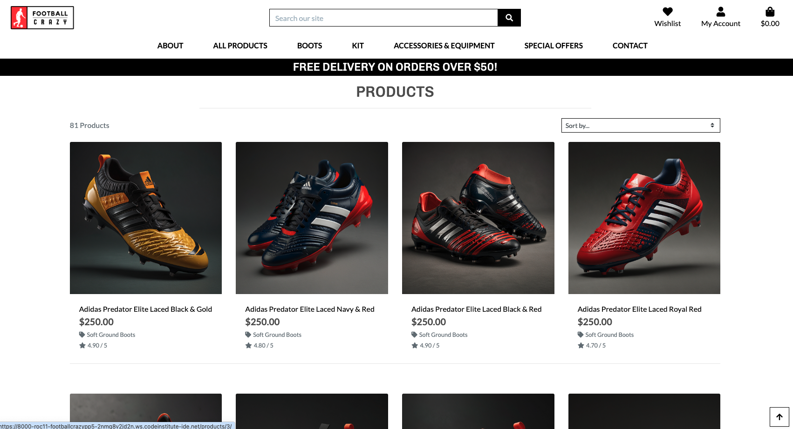   |  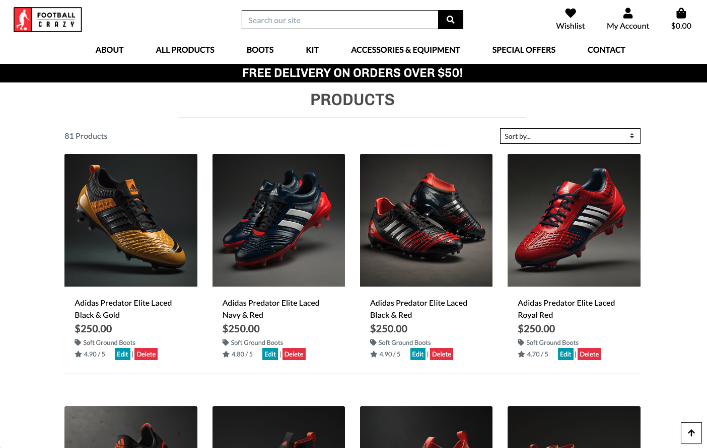 |  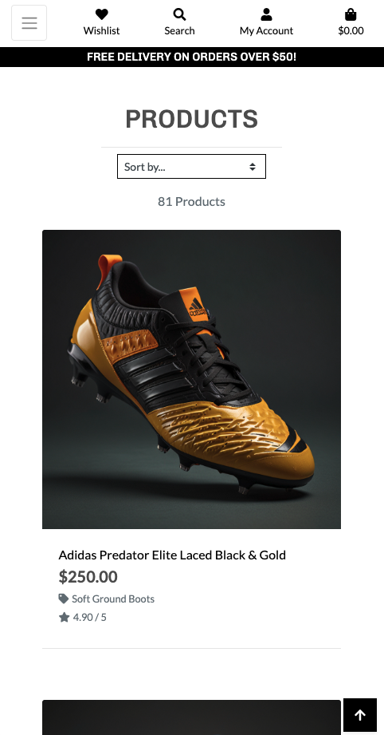

Code for Product Cards
```html

<div class="col-sm-6 col-md-6 col-lg-4 col-xl-3">
    <div class="card h-100 border-0">
        <!-- Render Product Image URL if image exits, or default Image if not -->
        
        <a href="">
            
        </a>
        
        <a href="">
            
        </a>
        
        <div class="card-body pb-0">
            <a href="">
                <p class="mb-0 prod-name-link text-black text-decoration-none">{{ product.name }}</p>
            </a>
        </div>
        <div class="card-footer bg-white pt-0 border-0 text-left">
            <div class="row">
                <div class="col">
                    <p class="lead mb-0 text-left font-weight-bold">${{ product.price }}</p>
                    
                        <p class="small mt-1 mb-0">
                            <a class="text-muted" href="?category={{ product.category.name }}">
                                <i class="fas fa-tag mr-1"></i>{{ product.category.friendly_name }}
                            </a>
                        </p>
                    
                    
                        <small class="text-muted"><i class="fas fa-star mr-1"></i>{{ product.rating }} / 5</small>
                    
                        <small class="text-muted">No Rating</small>
                    
                    <!-- Store Admin - edit/delete product -->
                    
                        <small class="ml-3">
                            <a href="" class="btn-info text-decoration-none p-1">Edit</a> |
                            <a href="" class="btn-danger text-decoration-none p-1">Delete</a>
                        </small>
                    
                </div>
            </div>
        </div> 
    </div>
</div>
```

#### Product Search

* As mentionined in the [Navigation Section](#navigation), there is a search bar which users/shoppers can use to search for a particular product or keyword. 
* In the screenshots below, the search term "navy" was used. All products with the word "navy" in their Product Name or Product Description are brought back from the database and displayed to the user. The search term is displayed in the top left of the first product row, as well as how many results matched the search. 

Search Bar             |  Product Search Results	 | Product search term and number of results
:-------------------------:|:-------------------------:|:-------------------------:
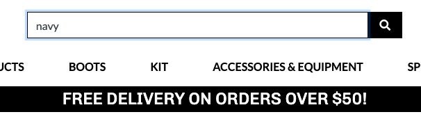   |  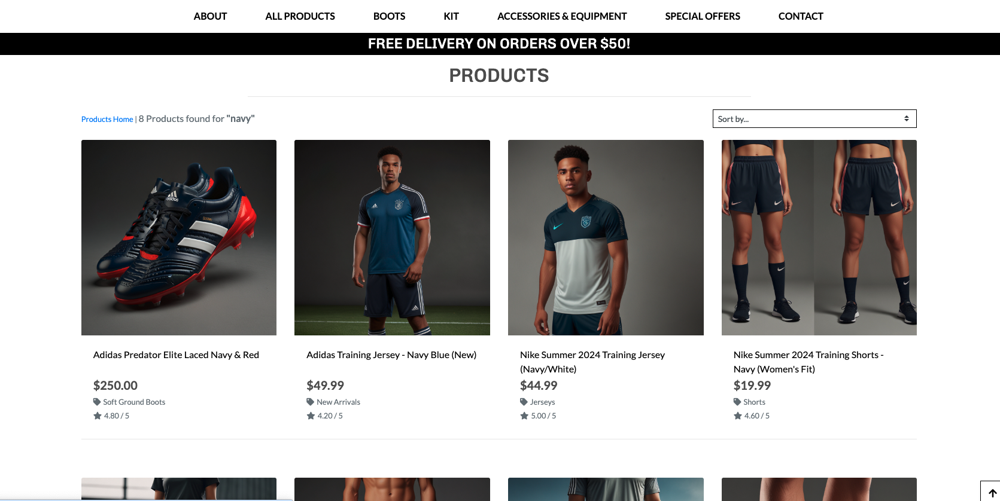 |  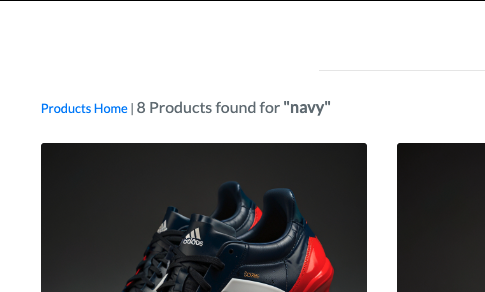

#### Product Filter & Sort

* Products can be filtered by category. Users can do this by clicking the main product type, e.g. Boots, in the Navbar and then choosing a category from the list, e.g. soft ground boots, or they can click the small category tag in the product card information. 

Product Category            |  Product Filter Results (by Kit > Shorts)	 | Product Card - Small Category Icon/Link
:-------------------------:|:-------------------------:|:-------------------------:
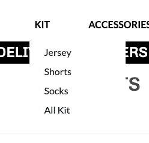   |   |  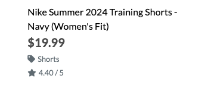

* Products can also be sorted. 
* Users can sort and search by Price, Rating and Category from the products tab on the navbar. 
* There is sort select box, handled by javascript, on the right hand side of the page. This sorts all of the products on the current page by price, rating, name or category. The sort direction can also be specified with this handy feature (ASC or DESC order).

Javascript Code for the Sort
```javascript
        $('#sort-selector').change(function() {
            var selector = $(this);
            var currentUrl = new URL(window.location);

            var selectedVal = selector.val();
            if(selectedVal != 'reset'){
                var sort = selectedVal.split("_")[0];
                var direction = selectedVal.split("_")[1];

                currentUrl.searchParams.set("sort", sort);
                currentUrl.searchParams.set("direction", direction);

                window.location.replace(currentUrl);
            } else {
                currentUrl.searchParams.delete("sort");
                currentUrl.searchParams.delete("direction");

                window.location.replace(currentUrl);
            }
        });
```

Sort Select             |  Sort Results - By Name A-Z
:-------------------------:|:-------------------------:
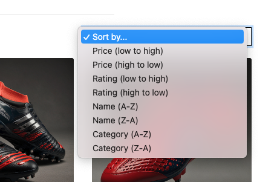 |  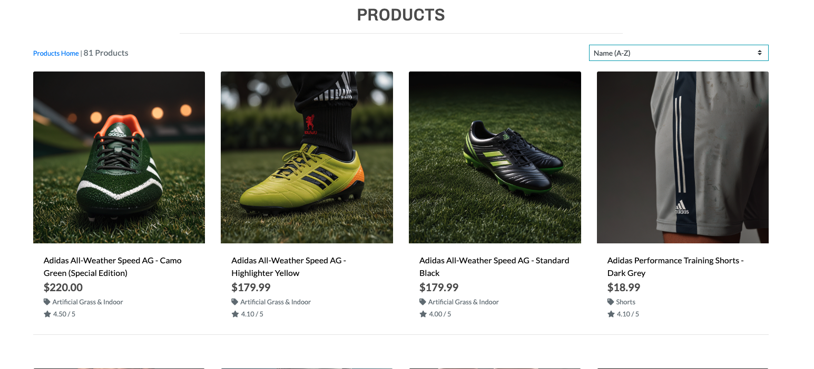 

### Product Reviews & Ratings (CRUD)

#### Add a Review

#### Edit a Review

#### Delete a Review

### Shopping Bag Page

### Checkout Page

### Checkout Success

### Product Admin Page/Functionality (CRUD)

### Profile Page

### Wishlist

### Contact Page

### About Page

### Newsletter

#### Newsletter Subscribe/Unsubscribe

#### Newsletter Admin Page

### 404 Error Page

### Alerts/Toasts/Messages

### Registration & Accounts

### Unresolved bugs

### Future Features/Improvements

## Tools & Technologies Used

## Database Design

Entity Relationship Diagrams (ERD) help to visualize database architecture before creating models. Understanding the relationships between different tables can save time later in the project.

To follow best practice, a database schema was created for the backend DB and tables, and mapped out before coding began using a free version of [Lucidchart](https://www.lucidchart.com/pages/ER-diagram-symbols-and-meaning).

Below is the database structure:


Below are the Models used for the project, used to create an ERD with the relationships identified in the schema:

```python

class Category(models.Model):
	name = models.CharField(max_length=254)
    friendly_name = models.CharField(max_length=254, null=True, blank=True)

class Product(models.Model):
	category = models.ForeignKey('Category', null=True, blank=True, on_delete=models.SET_NULL)
    sku = models.CharField(max_length=254, null=True, blank=True)
    name = models.CharField(max_length=254)
    description = models.TextField()
    has_sizes = models.BooleanField(default=False,null=True,blank=True)
    price = models.DecimalField(max_digits=6, decimal_places=2)
    rating = models.DecimalField(max_digits=6, decimal_places=2, null=True, blank=True)
    image_url = models.URLField(max_length=1024, null=True, blank=True)
    image = models.ImageField(null=True, blank=True)
    users_wishlist = models.ManyToManyField(User, related_name="user_wishlist", blank=True)

class Review(models.Model):
	product = models.ForeignKey(
        Product, related_name='reviews', on_delete=models.CASCADE)
    rating = models.IntegerField(default=3)
    content = models.TextField()
    created_by = models.ForeignKey(
        User, on_delete=models.CASCADE, related_name="review_by")
    created_on = models.DateTimeField(auto_now_add=True)
    approved = models.BooleanField(default=False)

class About(models.Model):
	title = models.CharField(max_length=200)
    profile_image_url = models.URLField(max_length=1024, null=True, blank=True)
    profile_image = models.ImageField(null=True, blank=True)
    updated_on = models.DateTimeField(auto_now=True)
    content = models.TextField()

class Order(models.Model):
	order_number = models.CharField(max_length=32, null=False, editable=False)
    user_profile = models.ForeignKey(UserProfile, on_delete=models.SET_NULL,
                                     null=True, blank=True, related_name='orders')
    full_name = models.CharField(max_length=50, null=False, blank=False)
    email = models.EmailField(max_length=254, null=False, blank=False)
    phone_number = models.CharField(max_length=20, null=False, blank=False)
    country = CountryField(blank_label='Country *', null=False, blank=False)
    postcode = models.CharField(max_length=20, null=True, blank=True)
    town_or_city = models.CharField(max_length=40, null=False, blank=False)
    street_address1 = models.CharField(max_length=80, null=False, blank=False)
    street_address2 = models.CharField(max_length=80, null=True, blank=True)
    county = models.CharField(max_length=80, null=True, blank=True)
    date = models.DateTimeField(auto_now_add=True)
    delivery_cost = models.DecimalField(max_digits=6, decimal_places=2, null=False, default=0)
    order_total = models.DecimalField(max_digits=10, decimal_places=2, null=False, default=0)
    grand_total = models.DecimalField(max_digits=10, decimal_places=2, null=False, default=0)
    original_bag = models.TextField(null=False, blank=False, default='')
    stripe_pid = models.CharField(max_length=254, null=False, blank=False, default='')

class OrderLineItem(models.Model):
	order = models.ForeignKey(
        Order, null=False, blank=False, on_delete=models.CASCADE, related_name='lineitems')
    product = models.ForeignKey(
        Product, null=False, blank=False, on_delete=models.CASCADE)
    product_size = models.CharField(max_length=2, null=True, blank=True)  # XS, S, M, L, XL
    quantity = models.IntegerField(null=False, blank=False, default=0)
    lineitem_total = models.DecimalField(max_digits=6, decimal_places=2, null=False, blank=False, editable=False)

class Contact(models.Model):
	name = models.CharField(max_length=200)
    email = models.EmailField()
    message = models.TextField()
    read = models.BooleanField(default=False)

class NewsletterSubscription(models.Model):
	email = models.EmailField(unique=True)
    name = models.CharField(max_length=100)
    subscribed_at = models.DateTimeField(auto_now_add=True)
    is_subscribed = models.BooleanField(default=True)

class UserProfile(models.Model):
	user = models.OneToOneField(User, on_delete=models.CASCADE)
    default_phone_number = models.CharField(max_length=20, null=True, blank=True)
    default_street_address1 = models.CharField(max_length=80, null=True, blank=True)
    default_street_address2 = models.CharField(max_length=80, null=True, blank=True)
    default_town_or_city = models.CharField(max_length=40, null=True, blank=True)
    default_county = models.CharField(max_length=80, null=True, blank=True)
    default_postcode = models.CharField(max_length=20, null=True, blank=True)
    default_country = CountryField(blank_label='Country', null=True, blank=True)

```

## Agile Development Process

[GitHub Projects](https://github.com/users/roc-11/projects/6) served as an Agile tool for this project.

The Football Crazy project was managed from the beginning using [GitHub Projects (View Project Here)](https://github.com/users/roc-11/projects/6/views/1), in order to ensure an agile approach.
  - The project goals were broken into Epics, each further divided into User Stories. 
  - Each User Story contains acceptance criteria and individual tasks.
  - Each individual User Story was assigned a specific number of story points determined by a rough estimate of the time required to complete the task.
  - This allowed me to create a roadmap with milestones. [View Roadmap Here](https://github.com/users/roc-11/projects/6/views/1?layout=roadmap)
  - Each User Story was also assigned a label (according to the MoSCoW System) so I could prioritise the work.


### Github Projects

The Football Crazy project was managed from the beginning using [GitHub Projects (View Project Here)](https://github.com/users/roc-11/projects/6), in order to ensure an agile approach. Please refer above to [Agile Development Process](#agile-development-process) for more details. 

### Github Issues

[GitHub Issues](https://github.com/roc-11/football-crazy-pp5/issues) served as an another Agile tool. There, I used my own **User Story Template** to manage user stories.

It also helped with milestone iterations on a weekly basis.

GitHub Issues were used to create Epics and User Stories for the project. Each issue was added to the Football Crazy Project and assigned relevant lables. Please refer above to [Agile Development Process](#agile-development-process) for more details. 


### MoSCoW Prioritisation

I've decomposed my Epics into stories prior to prioritizing and implementing them.
Using this approach, I was able to apply the MoSCow prioritization and labels to my user stories within the Issues tab.

- **Must Have**: guaranteed to be delivered 
- **Should Have**: adds significant value, but not vital 
- **Could Have**: has small impact if left out 
- **Won't Have**: not a priority for this iteration (future development)

Each User Story was also assigned a label (according to the MoSCoW System) so I could prioritise the work. Please refer above to [Agile Development Process](#agile-development-process) for more details. 

# Ecommerce Business Model

This site sells goods to individual customers, and therefore follows a `Business to Customer` model. It is of the simplest **B2C** forms, as it focuses on individual transactions, and doesn't need anything such as monthly/annual subscriptions.

As a B2C e-commerce platform, Football Crazy specialises in high-quality and elite football boots. Our goal is to become the go-to Football Boot provider in Ireland, offering a wide range of products through our online store.

It is still in its early development stages, although it already has a newsletter, and links for social media marketing.

Social media can potentially build a community of users around the business, and boost site visitor numbers, especially when using larger platforms such a Facebook.

A newsletter list can be used by the business to send regular messages to site users. For example, what items are on special offer, new items in stock, updates to business hours, notifications of events, and much more!

**Business Overview**
* The main business objective Football Crazy is to provide a seamless e-commerce experience for football players and coaches.
* Football Crazy is a retail store and it is a B2C (business to customer) type of business.
* The deliverables for the Football Crazy store are products (boots, kit, football accessories, gloves, shinpads and training equipment).
* The business uses a single payment system, that is the transaction is finished after a single payment is made.
* This business does not have a physical storefront, it is an online-only store

## Search Engine Optimization (SEO) & Social Media Marketing

### Keywords

I've identified some appropriate keywords to align with my site, that should help users
when searching online to find my page easily from a search engine.
This included a series of the following keyword types

- Short-tail (head terms) keywords
- Long-tail keywords

I also played around with [Word Tracker](https://www.wordtracker.com) a bit
to check the frequency of some of my site's primary keywords (only until the free trial expired).

### Sitemap

I've used [XML-Sitemaps](https://www.xml-sitemaps.com) to generate a sitemap.xml file.
This was generated using my deployed site URL: https://football-crazy-pp5-5b2eb292c933.herokuapp.com/

After it finished crawling the entire site, it created a
[sitemap.xml](sitemap.xml) which I've downloaded and included in the repository.

### Robots

I've created the [robots.txt](robots.txt) file at the root-level.
Inside, I've included the default settings:

```
User-agent: *
Disallow: /accounts/
Disallow: /bag/
Disallow: /checkout/
Disallow: /profiles/
Sitemap: https://https://football-crazy-pp5-5b2eb292c933.herokuapp.com/sitemap.xml
```

Further links for future implementation:
- [Google search console](https://search.google.com/search-console)
- [Creating and submitting a sitemap](https://developers.google.com/search/docs/advanced/sitemaps/build-sitemap)
- [Managing your sitemaps and using sitemaps reports](https://support.google.com/webmasters/answer/7451001)
- [Testing the robots.txt file](https://support.google.com/webmasters/answer/6062598)

### Social Media Marketing

Creating a strong social base (with participation) and linking that to the business site can help drive sales.
Using more popular providers with a wider user base, such as Facebook, typically maximizes site views.

I've created a Facebook business account using Facebook. The Football Crazy Facebook page can be [found here on this link](https://www.facebook.com/profile.php?id=61560702557497).

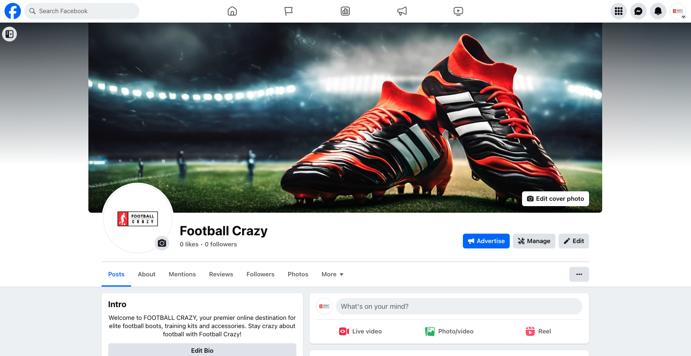

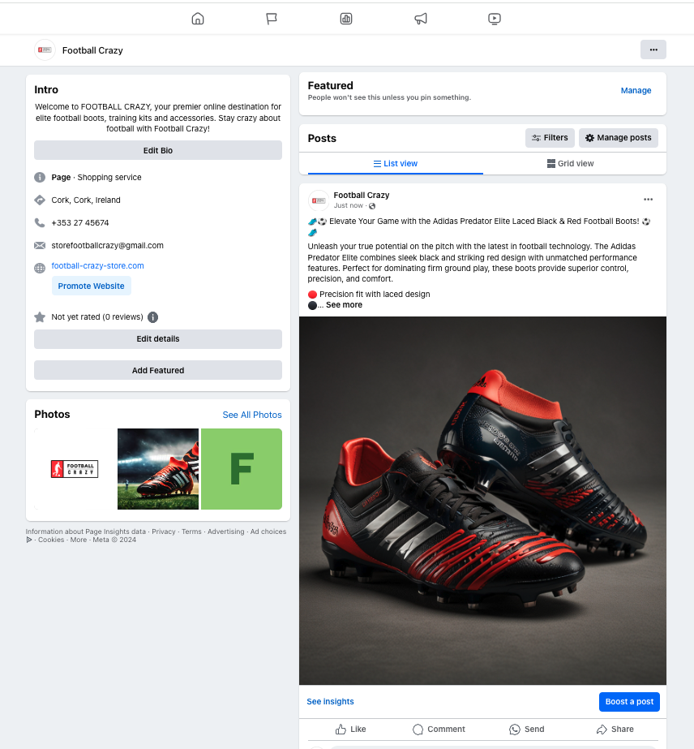

### Newsletter Marketing

I have incorporate a newsletter sign-up form on my application, to allow users to supply their
email address if they are interested in learning more. 

## Technologies Used 

The site has been built with the following tech and tools:
1. HTML5
2. CSS
3. JavaScript
4. Python
5. Django - database framework
6. Jinja - HTML logic rendering for dynamic content
7. ElephantSQL - database hosting
8. Amazon AWS - static files media hosting
9. Bootstrap 4
10. JQuery
11. GitHub Projects - agile management, kanban, roadmap and milestones
12. GitHub Repo - code storage
13. Git - version control
14. GitPod & VS Code - IDE
15. Heroku - live site hosting
16. Gmail - Football Crazy email to send real emails
17. Stripe - for secure payment/checkout

### Frameworks, Libraries & Programs Used


## Testing

For all testing, please refer to the [TESTING.md](TESTING.md) file.

## Deployment

The live deployed application can be found deployed on [Heroku](https://football-crazy-pp5-5b2eb292c933.herokuapp.com/).

### PostgreSQL Database

This project uses a [Code Institute PostgreSQL Database](https://dbs.ci-dbs.net).

To obtain my own Postgres Database from Code Institute, I followed these steps:

- Signed-in to the CI LMS using my email address.
- An email was sent to me with my new Postgres Database.

> [!CAUTION]  
> - PostgreSQL databases by Code Institute are only available to CI Students.
> - You must acquire your own PostgreSQL database through some other method
> if you plan to clone/fork this repository.
> - Code Institute students are allowed a maximum of 8 databases.
> - Databases are subject to deletion after 18 months.

### Amazon AWS

This project uses [AWS](https://aws.amazon.com) to store media and static files online, due to the fact that Heroku doesn't persist this type of data.

Once you've created an AWS account and logged-in, follow these series of steps to get your project connected.
Make sure you're on the **AWS Management Console** page.

#### S3 Bucket

- Search for **S3**.
- Create a new bucket, give it a name (matching your Heroku app name), and choose the region closest to you.
- Uncheck **Block all public access**, and acknowledge that the bucket will be public (required for it to work on Heroku).
- From **Object Ownership**, make sure to have **ACLs enabled**, and **Bucket owner preferred** selected.
- From the **Properties** tab, turn on static website hosting, and type `index.html` and `error.html` in their respective fields, then click **Save**.
- From the **Permissions** tab, paste in the following CORS configuration:

	```shell
	[
		{
			"AllowedHeaders": [
				"Authorization"
			],
			"AllowedMethods": [
				"GET"
			],
			"AllowedOrigins": [
				"*"
			],
			"ExposeHeaders": []
		}
	]
	```

- Copy your **ARN** string.
- From the **Bucket Policy** tab, select the **Policy Generator** link, and use the following steps:
	- Policy Type: **S3 Bucket Policy**
	- Effect: **Allow**
	- Principal: `*`
	- Actions: **GetObject**
	- Amazon Resource Name (ARN): **paste-your-ARN-here**
	- Click **Add Statement**
	- Click **Generate Policy**
	- Copy the entire Policy, and paste it into the **Bucket Policy Editor**

		```shell
		{
			"Id": "Policy1234567890",
			"Version": "2012-10-17",
			"Statement": [
				{
					"Sid": "Stmt1234567890",
					"Action": [
						"s3:GetObject"
					],
					"Effect": "Allow",
					"Resource": "arn:aws:s3:::your-bucket-name/*"
					"Principal": "*",
				}
			]
		}
		```

	- Before you click "Save", add `/*` to the end of the Resource key in the Bucket Policy Editor (like above).
	- Click **Save**.
- From the **Access Control List (ACL)** section, click "Edit" and enable **List** for **Everyone (public access)**, and accept the warning box.
	- If the edit button is disabled, you need to change the **Object Ownership** section above to **ACLs enabled** (mentioned above).

#### IAM

Back on the AWS Services Menu, search for and open **IAM** (Identity and Access Management).
Once on the IAM page, follow these steps:

- From **User Groups**, click **Create New Group**.
	- Suggested Name: `group-football-crazy-pp5` (group + the project name)
- Tags are optional, but you must click it to get to the **review policy** page.
- From **User Groups**, select your newly created group, and go to the **Permissions** tab.
- Open the **Add Permissions** dropdown, and click **Attach Policies**.
- Select the policy, then click **Add Permissions** at the bottom when finished.
- From the **JSON** tab, select the **Import Managed Policy** link.
	- Search for **S3**, select the `AmazonS3FullAccess` policy, and then **Import**.
	- You'll need your ARN from the S3 Bucket copied again, which is pasted into "Resources" key on the Policy.

		```shell
		{
			"Version": "2012-10-17",
			"Statement": [
				{
					"Effect": "Allow",
					"Action": "s3:*",
					"Resource": [
						"arn:aws:s3:::your-bucket-name",
						"arn:aws:s3:::your-bucket-name/*"
					]
				}
			]
		}
		```
	
	- Click **Review Policy**.
	- Suggested Name: `policy-football-crazy-pp5` (policy + the project name)
	- Provide a description:
		- "Access to S3 Bucket for football-crazy-pp5 static files."
	- Click **Create Policy**.
- From **User Groups**, click your "group-football-crazy-pp5".
- Click **Attach Policy**.
- Search for the policy you've just created ("policy-football-crazy-pp5") and select it, then **Attach Policy**.
- From **User Groups**, click **Add User**.
	- Suggested Name: `user-football-crazy-pp5` (user + the project name)
- For "Select AWS Access Type", select **Programmatic Access**.
- Select the group to add your new user to: `group-football-crazy-pp5`
- Tags are optional, but you must click it to get to the **review user** page.
- Click **Create User** once done.
- You should see a button to **Download .csv**, so click it to save a copy on your system.
	- **IMPORTANT**: once you pass this page, you cannot come back to download it again, so do it immediately!
	- This contains the user's **Access key ID** and **Secret access key**.
	- `AWS_ACCESS_KEY_ID` = **Access key ID**
	- `AWS_SECRET_ACCESS_KEY` = **Secret access key**

#### Final AWS Setup

- If Heroku Config Vars has `DISABLE_COLLECTSTATIC` still, this can be removed now, so that AWS will handle the static files.
- Back within **S3**, create a new folder called: `media`.
- Select any existing media images for your project to prepare them for being uploaded into the new folder.
- Under **Manage Public Permissions**, select **Grant public read access to this object(s)**.
- No further settings are required, so click **Upload**.

### Stripe API

This project uses [Stripe](https://stripe.com) to handle the ecommerce payments.

Once you've created a Stripe account and logged-in, follow these series of steps to get your project connected.

- From your Stripe dashboard, click to expand the "Get your test API keys".
- You'll have two keys here:
	- `STRIPE_PUBLIC_KEY` = Publishable Key (starts with **pk**)
	- `STRIPE_SECRET_KEY` = Secret Key (starts with **sk**)

As a backup, in case users prematurely close the purchase-order page during payment, we can include Stripe Webhooks.

- From your Stripe dashboard, click **Developers**, and select **Webhooks**.
- From there, click **Add Endpoint**.
	- `https://football-crazy-roc11.herokuapp.com/checkout/wh/`
- Click **receive all events**.
- Click **Add Endpoint** to complete the process.
- You'll have a new key here:
	- `STRIPE_WH_SECRET` = Signing Secret (Wehbook) Key (starts with **wh**)

### Gmail API

This project uses [Gmail](https://mail.google.com) to handle sending emails to users for account verification and purchase order confirmations.

Once you've created a Gmail (Google) account and logged-in, follow these series of steps to get your project connected.

- Click on the **Account Settings** (cog icon) in the top-right corner of Gmail.
- Click on the **Accounts and Import** tab.
- Within the section called "Change account settings", click on the link for **Other Google Account settings**.
- From this new page, select **Security** on the left.
- Select **2-Step Verification** to turn it on. (verify your password and account)
- Once verified, select **Turn On** for 2FA.
- Navigate back to the **Security** page, and you'll see a new option called **App passwords**.
- This might prompt you once again to confirm your password and account.
- Select **Mail** for the app type.
- Select **Other (Custom name)** for the device type.
	- Any custom name, such as "Django" or football-crazy-pp5
- You'll be provided with a 16-character password (API key).
	- Save this somewhere locally, as you cannot access this key again later!
	- `EMAIL_HOST_PASS` = user's 16-character API key
	- `EMAIL_HOST_USER` = user's own personal Gmail email address

### Heroku Deployment

This project uses [Heroku](https://www.heroku.com), a platform as a service (PaaS) that enables developers to build, run, and operate applications entirely in the cloud.

Deployment steps are as follows, after account setup:

- Select **New** in the top-right corner of your Heroku Dashboard, and select **Create new app** from the dropdown menu.
- Your app name must be unique, and then choose a region closest to you (EU or USA), and finally, select **Create App**.
- From the new app **Settings**, click **Reveal Config Vars**, and set your environment variables.

> [!IMPORTANT]  
> This is a sample only; you would replace the values with your own if cloning/forking my repository.

| Key | Value |
| --- | --- |
| `AWS_ACCESS_KEY_ID` | user's own value |
| `AWS_SECRET_ACCESS_KEY` | user's own value |
| `DATABASE_URL` | user's own value |
| `DISABLE_COLLECTSTATIC` | 1 (*this is temporary, and can be removed for the final deployment*) |
| `EMAIL_HOST_PASS` | user's own value |
| `EMAIL_HOST_USER` | user's own value |
| `SECRET_KEY` | user's own value |
| `STRIPE_PUBLIC_KEY` | user's own value |
| `STRIPE_SECRET_KEY` | user's own value |
| `STRIPE_WH_SECRET` | user's own value |
| `USE_AWS` | True |

Heroku needs three additional files in order to deploy properly.

- requirements.txt
- Procfile
- runtime.txt

You can install this project's **requirements** (where applicable) using:

- `pip3 install -r requirements.txt`

If you have your own packages that have been installed, then the requirements file needs updated using:

- `pip3 freeze --local > requirements.txt`

The **Procfile** can be created with the following command:

- `echo web: gunicorn app_name.wsgi > Procfile`
- *replace **app_name** with the name of your primary Django app name; the folder where settings.py is located*

The **runtime.txt** file needs to know which Python version you're using:
1. type: `python3 --version` in the terminal.
2. in the **runtime.txt** file, add your Python version:
	- `python-3.9.18`

For Heroku deployment, follow these steps to connect your own GitHub repository to the newly created app:

Either:

- Select **Automatic Deployment** from the Heroku app.

Or:

- In the Terminal/CLI, connect to Heroku using this command: `heroku login -i`
- Set the remote for Heroku: `heroku git:remote -a app_name` (replace *app_name* with your app name)
- After performing the standard Git `add`, `commit`, and `push` to GitHub, you can now type:
	- `git push heroku main`

The project should now be connected and deployed to Heroku!

### Local Deployment

This project can be cloned or forked in order to make a local copy on your own system.

For either method, you will need to install any applicable packages found within the *requirements.txt* file.

- `pip3 install -r requirements.txt`.

You will need to create a new file called `env.py` at the root-level,
and include the same environment variables listed above from the Heroku deployment steps.

> [!IMPORTANT]  
> This is a sample only; you would replace the values with your own if cloning/forking my repository.

Sample `env.py` file:

```python
import os

os.environ.setdefault("AWS_ACCESS_KEY_ID", "user's own value")
os.environ.setdefault("AWS_SECRET_ACCESS_KEY", "user's own value")
os.environ.setdefault("DATABASE_URL", "user's own value")
os.environ.setdefault("EMAIL_HOST_PASS", "user's own value")
os.environ.setdefault("EMAIL_HOST_USER", "user's own value")
os.environ.setdefault("SECRET_KEY", "user's own value")
os.environ.setdefault("STRIPE_PUBLIC_KEY", "user's own value")
os.environ.setdefault("STRIPE_SECRET_KEY", "user's own value")
os.environ.setdefault("STRIPE_WH_SECRET", "user's own value")

# local environment only (do not include these in production/deployment!)
os.environ.setdefault("DEBUG", "True")
```

Once the project is cloned or forked, in order to run it locally, you'll need to follow these steps:

- Start the Django app: `python3 manage.py runserver`
- Stop the app once it's loaded: `CTRL+C` or `⌘+C` (Mac)
- Make any necessary migrations: `python3 manage.py makemigrations`
- Migrate the data to the database: `python3 manage.py migrate`
- Create a superuser: `python3 manage.py createsuperuser`
- Load fixtures (if applicable): `python3 manage.py loaddata file-name.json` (repeat for each file)
- Everything should be ready now, so run the Django app again: `python3 manage.py runserver`

If you'd like to backup your database models, use the following command for each model you'd like to create a fixture for:

- `python3 manage.py dumpdata your-model > your-model.json`
- *repeat this action for each model you wish to backup*

#### Cloning

You can clone the repository by following these steps:

1. Go to the [GitHub repository](https://github.com/roc-11/football-crazy-pp5) 
2. Locate the Code button above the list of files and click it 
3. Select if you prefer to clone using HTTPS, SSH, or GitHub CLI and click the copy button to copy the URL to your clipboard
4. Open Git Bash or Terminal
5. Change the current working directory to the one where you want the cloned directory
6. In your IDE Terminal, type the following command to clone my repository:
	- `git clone https://github.com/roc-11/football-crazy-pp5.git`
7. Press Enter to create your local clone.

Alternatively, if using Gitpod, you can click below to create your own workspace using this repository.

[](https://gitpod.io/#https://github.com/roc-11/football-crazy-pp5)

Please note that in order to directly open the project in Gitpod, you need to have the browser extension installed.
A tutorial on how to do that can be found [here](https://www.gitpod.io/docs/configure/user-settings/browser-extension).

#### Forking

By forking the GitHub Repository, we make a copy of the original repository on our GitHub account to view and/or make changes without affecting the original owner's repository.
You can fork this repository by using the following steps:

1. Log in to GitHub and locate the [GitHub Repository](https://github.com/roc-11/football-crazy-pp5)
2. At the top of the Repository (not top of page) just above the "Settings" Button on the menu, locate the "Fork" Button.
3. Once clicked, you should now have a copy of the original repository in your own GitHub account!

### Local VS Deployment

## Credits

### Code

I followed a number of tutorials in order to create this Django website. I was also inspired and helped by the "Boutique Ado" & "I Think Therefore I Blog" Code institute walkthrough projects.
* [Django Ecommerce Website | Product Reviews | Htmx and Tailwind | Part 20 by 'Code with Stein'](https://www.youtube.com/watch?v=8iCqlFyFu2s)
* [Python Django Ecommerce Customer Wish List by 'Very Academy'](https://www.youtube.com/watch?v=OgA0TTKAtqQ)
* [Django Tutorial - Introduction no Subscribers and Newsletter #18 by 'Python Lessons'](https://www.youtube.com/watch?v=wl4Yxo5_Cgw)
* [Build a Newsletter Section for Your Django Web Application by 'KenBroTech'](https://www.youtube.com/watch?v=hWtlskOaFNI)
* [Testing in Django](https://docs.djangoproject.com/en/4.2/topics/testing/)
* [How To Style Django Admin Panel](https://medium.com/@rajparmar23801/how-to-style-django-admin-panel-583944334c55)

### Content

* All product descriptions were generated using [ChapGPT](https://openai.com/index/chatgpt/) by the website developer. 

* I was hugely inspired by [ProdirectSoccer](https://www.prodirectsport.com/soccer/) for this e-commerce site. Although no content was taken from ProDirectSoccer, it was the basis on which Football Crazy came to be. 

* All other content was written by the developer.

### Media

* All product images were generated with Generative AI using the website [leonardo.ai](https://leonardo.ai/). 

* The about image was also generated with Generative AI using the website [leonardo.ai](https://leonardo.ai/). 

* Hero Image - Generated using [Canva](https://www.canva.com/) AI Magic feature, and extended using [Adobe Photoshop](https://www.adobe.com/ie/products/photoshop/landpa.html?gclid=Cj0KCQjwvb-zBhCmARIsAAfUI2sQ-579PWJuFVy750U14vPEel_uLYYJpZyAMWNRar9E-3A0VRUF_T8aAo8oEALw_wcB&mv=search&mv=search&mv2=paidsearch&sdid=2XBSBWBF&ef_id=Cj0KCQjwvb-zBhCmARIsAAfUI2sQ-579PWJuFVy750U14vPEel_uLYYJpZyAMWNRar9E-3A0VRUF_T8aAo8oEALw_wcB:G:s&s_kwcid=AL!3085!3!441704131147!e!!g!!adobe%20photoshop!1423511192!58810496314&gad_source=1) to fit the dimensions required for the website.

* The Football Crazy Site logo and favicon were created using [Canva](https://www.canva.com/) and Adobe Photoshop.

* The icons across the site were sourced from [Font Awesome](https://fontawesome.com/ "Link to Font Awesome homepage")

## Acknowledgements

- I would like to thank my Code Institute mentor, [Oluwaseun Owonikoko](https://github.com/seunkoko) for their support throughout the development of this project.
- I would like to thank the [Code Institute](https://codeinstitute.net) tutor team for their assistance with troubleshooting and debugging some project issues. They really helped me find my way with some tricky bugs and I am very thankful for their guidance. 
- I would like to thank the [Code Institute Slack community](https://code-institute-room.slack.com) for the moral support; it kept me going during periods of self doubt and imposter syndrome.
- I would like to thank my partner, for believing in me, and allowing me to make this transition into software development.
- I would like to thank my employer, for supporting me in my career development change towards becoming a software developer.