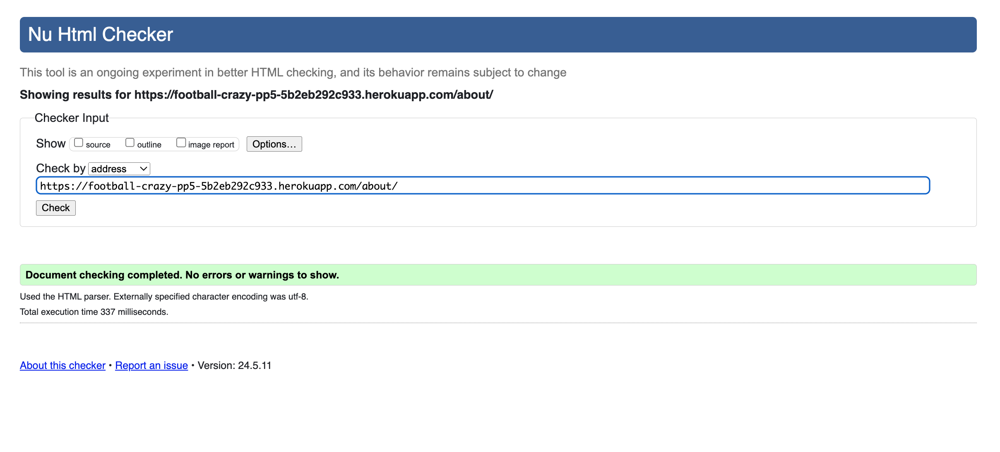
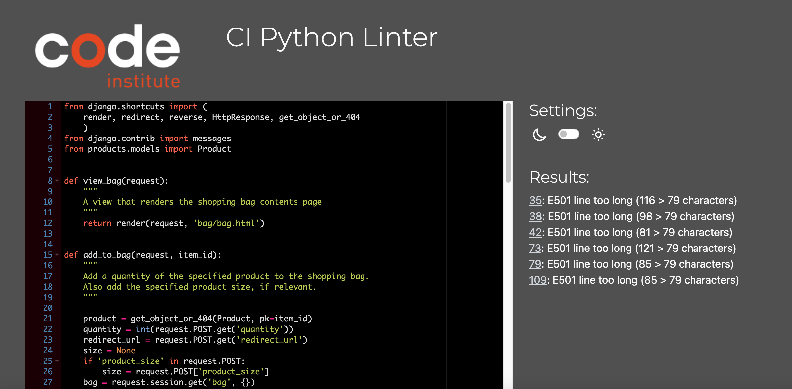
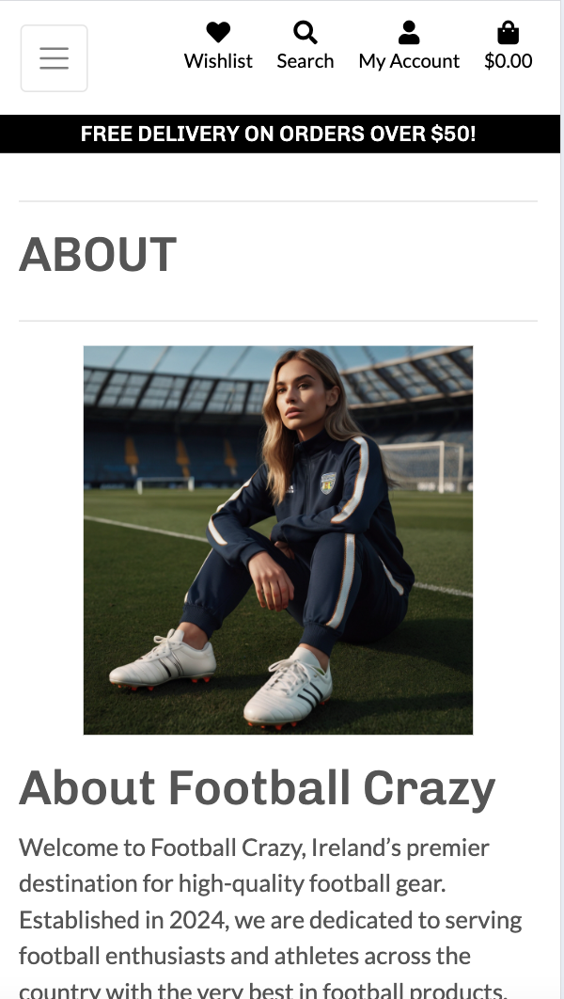
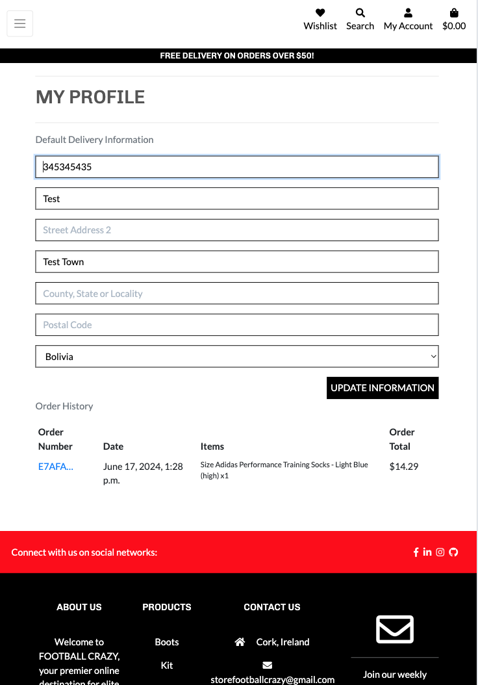
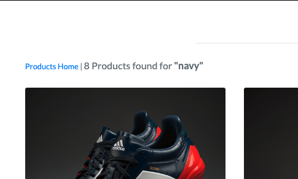
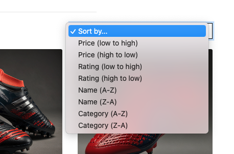
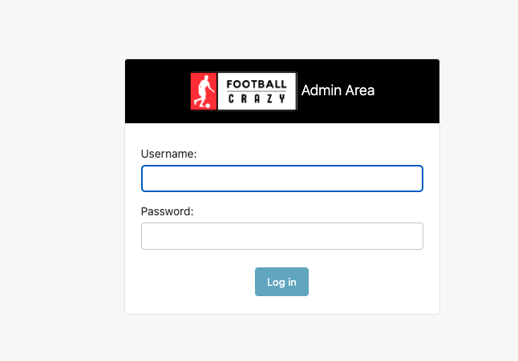

# Testing

> [!NOTE]  
> Return back to the [README.md](README.md) file.

## Code Validation

### HTML

I have used the recommended [HTML W3C Validator](https://validator.w3.org) to validate all of my HTML files.

| Directory | File | Screenshot | Notes |
| --- | --- | --- | --- |
| home | index.html |  | |
| about | about.html |  | |
| bag | bag.html |  | |
| checkout | checkout.html |  | |
| checkout success | checkout_success.html |  | |
| contact | contact.html |  | |
| products | products.html |  | |
| product detail | product_detail.html |  | |
| add a product | add_product.html |  | |
| edit a product | edit_product.html |  | |
| profile | profile.html |  | |
| wishlist | wishlist.html |  | |

### Python

I have used the recommended [PEP8 CI Python Linter](https://pep8ci.herokuapp.com) to validate all of my Python files.

| Directory | File | CI URL | Screenshot | Notes |
| --- | --- | --- | --- | --- |
| football_crazy | settings.py | [PEP8 CI](https://pep8ci.herokuapp.com/https://raw.githubusercontent.com/roc-11/football-crazy-pp5/main/football_crazy/settings.py) |  | E501 Line too long and E127 continuation line over-indented for visual indent. Does not affect functionality. |
| football_crazy | urls.py | [PEP8 CI](https://pep8ci.herokuapp.com/https://raw.githubusercontent.com/roc-11/football-crazy-pp5/main/football_crazy/urls.py) |  | |
| home | urls.py | [PEP8 CI](https://pep8ci.herokuapp.com/https://raw.githubusercontent.com/roc-11/football-crazy-pp5/main/home/urls.py) |  | |
| home | views.py | [PEP8 CI](https://pep8ci.herokuapp.com/https://raw.githubusercontent.com/roc-11/football-crazy-pp5/main/home/views.py) |  | |
|  | manage.py | [PEP8 CI](https://pep8ci.herokuapp.com/https://raw.githubusercontent.com/roc-11/football-crazy-pp5/main/manage.py) |  | |
| about | urls.py | [PEP8 CI](https://pep8ci.herokuapp.com/https://raw.githubusercontent.com/roc-11/football-crazy-pp5/main/about/urls.py) |  | |
| about | views.py | [PEP8 CI](https://pep8ci.herokuapp.com/https://raw.githubusercontent.com/roc-11/football-crazy-pp5/main/about/views.py) |  | |
| about | models.py | [PEP8 CI](https://pep8ci.herokuapp.com/https://raw.githubusercontent.com/roc-11/football-crazy-pp5/main/about/models.py) |  | |
| about | admin.py | [PEP8 CI](https://pep8ci.herokuapp.com/https://raw.githubusercontent.com/roc-11/football-crazy-pp5/main/about/admin.py) |  | |
| bag | urls.py | [PEP8 CI](https://pep8ci.herokuapp.com/https://raw.githubusercontent.com/roc-11/football-crazy-pp5/main/bag/urls.py) |  | |
| bag | views.py | [PEP8 CI](https://pep8ci.herokuapp.com/https://raw.githubusercontent.com/roc-11/football-crazy-pp5/main/bag/views.py) |  | 102: E501 line too long (98 > 79 characters) |
| bag | models.py | [PEP8 CI](https://pep8ci.herokuapp.com/https://raw.githubusercontent.com/roc-11/football-crazy-pp5/main/bag/models.py) |  | |
| bag | admin.py | [PEP8 CI](https://pep8ci.herokuapp.com/https://raw.githubusercontent.com/roc-11/football-crazy-pp5/main/bag/admin.py) |  | |
| bag | contexts.py | [PEP8 CI](https://pep8ci.herokuapp.com/https://raw.githubusercontent.com/roc-11/football-crazy-pp5/main/bag/contexts.py) |  | E122 continuation line missing indentation or outdented |
| checkout | urls.py | [PEP8 CI](https://pep8ci.herokuapp.com/https://raw.githubusercontent.com/roc-11/football-crazy-pp5/main/checkout/urls.py) |  | E501 line too long (93 > 79 characters) |
| checkout | views.py | [PEP8 CI](https://pep8ci.herokuapp.com/https://raw.githubusercontent.com/roc-11/football-crazy-pp5/main/checkout/views.py) |  | E501 line too long (98 > 79 characters) |
| checkout | models.py | [PEP8 CI](https://pep8ci.herokuapp.com/https://raw.githubusercontent.com/roc-11/football-crazy-pp5/main/checkout/models.py) |  | E501 line too long (98 > 79 characters) |
| checkout | admin.py | [PEP8 CI](https://pep8ci.herokuapp.com/https://raw.githubusercontent.com/roc-11/football-crazy-pp5/main/checkout/admin.py) |  |E127 continuation line over-indented for visual indent|
| checkout | forms.py | [PEP8 CI](https://pep8ci.herokuapp.com/https://raw.githubusercontent.com/roc-11/football-crazy-pp5/main/checkout/forms.py) |  | |
| newsletter | urls.py | [PEP8 CI](https://pep8ci.herokuapp.com/https://raw.githubusercontent.com/roc-11/football-crazy-pp5/main/newsletter/urls.py) |  | |
| newsletter | views.py | [PEP8 CI](https://pep8ci.herokuapp.com/https://raw.githubusercontent.com/roc-11/football-crazy-pp5/main/newsletter/views.py) |  | E128 continuation line under-indented for visual indent & E125 continuation line with same indent as next logical line|
| newsletter | models.py | [PEP8 CI](https://pep8ci.herokuapp.com/https://raw.githubusercontent.com/roc-11/football-crazy-pp5/main/newsletter/models.py) |  | |
| newsletter | admin.py | [PEP8 CI](https://pep8ci.herokuapp.com/https://raw.githubusercontent.com/roc-11/football-crazy-pp5/main/newsletter/admin.py) |  | |
| newsletter | forms.py | [PEP8 CI](https://pep8ci.herokuapp.com/https://raw.githubusercontent.com/roc-11/football-crazy-pp5/main/newsletter/forms.py) |  | |
| products | urls.py | [PEP8 CI](https://pep8ci.herokuapp.com/https://raw.githubusercontent.com/roc-11/football-crazy-pp5/main/products/urls.py) |  | E501 line too long (98 > 79 characters) |
| products | views.py | [PEP8 CI](https://pep8ci.herokuapp.com/https://raw.githubusercontent.com/roc-11/football-crazy-pp5/main/products/views.py) |  | E501 line too long (98 > 79 characters) |
| products | models.py | [PEP8 CI](https://pep8ci.herokuapp.com/https://raw.githubusercontent.com/roc-11/football-crazy-pp5/main/products/models.py) |  | |
| products | admin.py | [PEP8 CI](https://pep8ci.herokuapp.com/https://raw.githubusercontent.com/roc-11/football-crazy-pp5/main/products/admin.py) |  | |
| products | forms.py | [PEP8 CI](https://pep8ci.herokuapp.com/https://raw.githubusercontent.com/roc-11/football-crazy-pp5/main/products/forms.py) |  | |
| profiles | urls.py | [PEP8 CI](https://pep8ci.herokuapp.com/https://raw.githubusercontent.com/roc-11/football-crazy-pp5/main/profiles/urls.py) |  | E501 line too long (98 > 79 characters) |
| profiles | views.py | [PEP8 CI](https://pep8ci.herokuapp.com/https://raw.githubusercontent.com/roc-11/football-crazy-pp5/main/profiles/views.py) |  |  |
| profiles | models.py | [PEP8 CI](https://pep8ci.herokuapp.com/https://raw.githubusercontent.com/roc-11/football-crazy-pp5/main/profiles/models.py) |  | |
| profiles | admin.py | [PEP8 CI](https://pep8ci.herokuapp.com/https://raw.githubusercontent.com/roc-11/football-crazy-pp5/main/profiles/admin.py) |  | |
| profiles | forms.py | [PEP8 CI](https://pep8ci.herokuapp.com/https://raw.githubusercontent.com/roc-11/football-crazy-pp5/main/profiles/forms.py) |  | E501 line too long (98 > 79 characters) |


## Browser Compatibility

I've tested my deployed project on multiple browsers to check for compatibility issues.

| Browser | Home | About | Contact | Products | Product Detail | My Profile |Notes |
| --- | --- | --- | --- | --- | --- | --- | --- |
| Chrome |  |  |  |  |  |  |Works as expected |
| Firefox |  |  |  |  |  |  | Works as expected |
| Safari |  |  |  |  |  |  | Works as expected |

## Responsiveness

I've tested my deployed project on multiple devices to check for responsiveness issues.

| Device | Home | About | Contact | Product | Product Detail | Profile | Notes |
| --- | --- | --- | --- | --- | --- | --- | --- |
| Mobile (DevTools) |  |  |  |  |  | | Works as expected |
| Tablet (DevTools) |  |  |  |  |  |  | Works as expected |
| Desktop |  |  |  |  |  |  |Works as expected |

## Lighthouse Audit

I've tested my deployed project using the Lighthouse Audit tool to check for any major issues. No major issues were found, although at times it seemed to take a while for AWS to serve the home hero image.

Unfortunately, on the day of documenting this testing file, I was unable to take many screenshots. My internet connection was poor and I was getting strange Lighthouse results. 

I asked a Code Institute tutor for assistance and he sent me the screenshot below:


I ran tests for the site on [lighthouse-metrics.com](https://lighthouse-metrics.com/) and the following were the results:


I tried to test the website using Lighthouse on Google DevTools using my work laptop and got the following results, with no major issues:


## Defensive Programming

I have implemented defensive programming throughout the project. This was done in combination of try catch blocks in Python and using Python messages. All HTML forms are validated on the front end, using a combination of HTML and Javascript form validation. Customer errors were pre-empted as much as possible and plans put in place to prevent them.

Defensive programming was manually tested with the below user acceptance testing:
(This is not an exhaustive list. Everything was tested extensively during the development and testing stage.)
(Examples of manual testing also exist in screenshots on the [README.md](README.md) file)

- All links take the user to the relevant page. PASS

- Any page requiring authentication is accounting for in the Python Script and on the front end. PASS
- If a user attempts to access an out of bounds area, for which they do not have permission, they are re-directed to the login page. PASS

- Homepage - user enters invalid email in subscription form - error message. PASS


- Signup - form validated on the front end (username, password, email) PASS
- Signup - confirmation message and email sent to validate email address. PASS
- Signup - success email validation. User account created and verified. PASS


- Add product to bag, with correct quantity and size. PASS
- Success message on add to bag. PASS
- Success message when bag updated and can see update on the front end. PASS
- Defensive programming on the quantity selector [product detail and bag page] - limit min=1, max=98. PASS
- Stripe validation with error messages on the checkout page. PASS
- Email sent to user on successful checkout. PASS
- User redirected to checkout success page on successful checkout. PASS


- Products sorting, searching and filtering works as expected. PASS 
(See README.md Products Features section for screenshots and more information on this)
- User is notified when they submit a review. PASS 
- User can see the review is pending approval. PASS 
- User can only edit their own review. PASS 
- User can only delete their own review. PASS 





- The add to wishlist button works as expected. PASS
- Users can click remove from wishlist button to remove item from their wishlist. PASS
- Users who try to access the wishlist page without an account are redirected to the login page. PASS


## User Story Testing

| User Story | Screenshot |
| --- | --- |
| As a new site user, I would like to I would like to view a responsive website, so that I can use any device. |  |
| As a new site user, I would like to checkout as a guest without creating an account, so that I can purchase without an account. |  |
| As a new site user, I would like to create an account, so that I can store my delivery details, save my order history and submit product reviews. |  |
| As a new site user, I would like to add products to my wishlist, so that I can return to them at a later date/time. |  |
| As a new site user, I would like to easily edit and delete any reviews that I write, so that I can control what reviews I submit and edit or delete them if I wish. |  |
| As a new site user, I would like to easily contact the website administrators, so that I can ask questions. |  |
| As a new site user, I should be able to easily understand the main purpose of the site/store, so that I can know what type of website I am on immediately. |  |

| User Story | Screenshot |
| --- | --- |
| As a returning site user, I would like to I would like to view a responsive website, so that I can use any device and have an easy shopping experience. |  |
| As a returning site user, I would like to log into my account, so that I can edit my delivery details, view my order history and submit product reviews. |  |
| As a returning site user, I would like to my stored/saved delivery information, so that I can checkout quickly. |  |
| As a returning site user, I would like to add products to my wishlist, so that I can return to them at a later date/time. |  |
| As a returning site user, I would like to easily edit and delete any reviews that I write, so that I can control what reviews I submit and edit or delete them if I wish. |  |

| User Story | Screenshot |
| --- | --- |
| As a site administrator, I would like to I would like to have a recognizable branded Django admininstator area, so that I know which website I'm working on. |  |
| As a site administrator, I would like to use the front end to add a new product to the store, so that I can update my store regularly without having any coding knowledge and use a user-friendly UI. |  |
| As a site administrator, I would like to easily edit or delete a product from the store from the front-end/website, so that I can keep my online store up to date. |  |
| As a site administrator, I would like to easily send a newsletter email to all newsletter subscribers using a user-friendly UI, so that I can keep customers interested and engaged with my store, and encourage purchases. |  |
| As a site administrator, I would like to easily edit the about text and profile picture using a user-friendly UI, so that I the website is keep fresh and up to date. |  |
| As a site administrator, I would like to have control over approving site user reviews before they appear on the Football Crazy Store website, so that no spam or bot reviews appear on the site. |  |
| As a site administrator, I would like to manage user contact requests , so that I can response to requests/questions in a timely manner. |  |

## Automated Testing

Unfortunately, I did not have time to conduct a series of automated tests on my application.

I fully acknowledge and understand that, in a real-world scenario, an extensive set of tests would be required.

## Bugs

- Django jinga not rendering on Checkout Success Email

    - The checkout success message was sending successfully to the customer email, however it was missing all the content sent from the view. 
    

    - To fix this I added the CONTEXT to the email message and subject. This sent the context 'order':order to the email .txt files. Now the confirmation email contains all the necessary information the customer would need.
    

```python
 # send order confirmation email
    subject = render_to_string(
        'checkout/confirmation_emails/confirmation_email_subject.txt', {'order': order,}
    )
    html_message = render_to_string(
        'checkout/confirmation_emails/confirmation_email_body.txt', {'order': order,}
    )
    plain_message = strip_tags(html_message)
    from_email = settings.DEFAULT_FROM_EMAIL
    recipient_list = [order.email]
    send_mail(
        subject,
        plain_message,
        from_email,
        recipient_list,
        html_message=html_message
    )
```

- Gmail password naming error: preventing sending of real emails. This bug took me a long time to debug and it was a simple typo error. Result was a "500 error" on any page which required email in production (register, checkout, etc.)

    - To fix this, I changed:
    EMAIL_HOST_PASS = os.environ.get('EMAIL_HOST_PASS')
    to
    EMAIL_HOST_PASSWORD = os.environ.get('EMAIL_HOST_PASS').
    - I also had to reflect this change in the Heroku Config Vars.

    

    

- Django/Python error: I had duplicate workspaces. This caused a huge error in the IDE. 

    - To fix this, I deleted one workspace, and pinned the one I kept. I had to reinstall Django and allauth. This was near the beginnning of my project.

- AWS Free Tier Filling warning

    - To fix this I added the config var DISABLE_COLLECT_STATIC = 1 back in Heroku so that I could test the site without worrying about charges, during the development process. This reduced the amount of requests being made significantly.
    - I considered switching from AWS to Cloudinary, but it would have required too many changes at that late stage of the development process.

- HTML duplicate ID error on validation : id="user-options" there for mobile and desktop version with same ID. This was for the My Account dropdown navigation feature.

    - To fix this I changed the mobile-top-header.html id="user-options-mobile" & aria-labelledby="user-options-mobile".

- Error with the decrement and increment buttons on the Bag page not working as expected. The minus quantity button in the bag is meant to be disabled when the quantity hits 1. There is a duplicate quantity-form ID.

    - To fix this I followed the steps listed on the Code Institute Boutique Ado Project. I changed the ID on the quantity-form to a class, and refactor the JavaScript to look for elements with the same class name and perform the appropriate actions.

> [!NOTE]  
> There are no remaining bugs that I am aware of.
